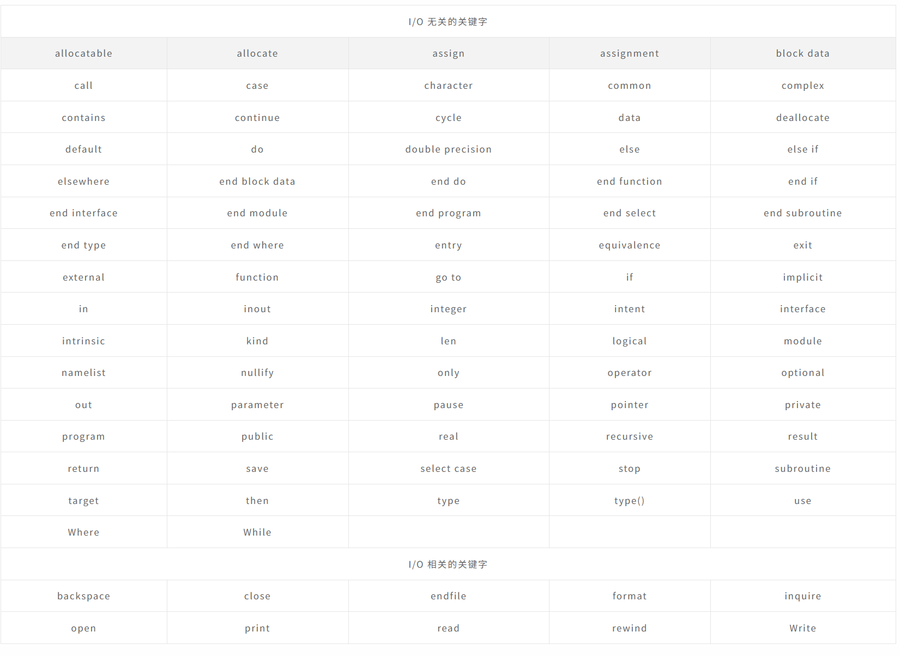

# Fortran笔记-1

# Fortran概念

Fortran 源自公式翻译系统，是一种通用的命令式编程语言。

它用于数值和科学计算。
Fortran 最初由 IBM 在 1950 年代开发，用于科学和工程应用程序。Fortran 统治了这个编程领域很长一段时间，并且在高性能计算方面变得非常流行。

其支持：

- 数值分析与科学计算
- 结构化编程
- 数组编程
- 模块化编程
- 通用编程
- 超级计算机上的高性能计算
- 面向对象编程
- 并发编程
- 计算机系统之间的合理可移植程度

# Fortran基本语法

## 简述

Fortran 程序由程序单元的集合组成，例如主程序、模块和外部子程序或过程。
每个程序包含一个主程序，可能包含也可能不包含其他程序单元。主程序的语法如下：

```fortran
program program_name
implicit none      
! type declaration statements      
! executable statements  
end program program_name
```

## 编写一个简单程序

```fortran
program addNumbers
! This simple program adds two numbers
   implicit none
! Type declarations
   real :: a, b, result
! Executable statements
   a = 12.0
   b = 15.0
   result = a + b
   print *, 'The total is ', result
end program addNumbers
```

**注意事项**

- 所有 Fortran 程序都以关键字开头**program**并以关键字结尾**end program,**后跟程序的名称。
- 这**implicit none**语句允许编译器检查所有变量类型是否正确明。您必须始终使用**implicit none**在每个程序的开始。
- Fortran 中的注释以感叹号 (!) 开头，因为编译器会忽略此之后的所有字符（字符串除外）。
- 这**print ***命令在屏幕上显示数据。
- 代码行的缩进是保持程序可读性的好习惯。
- Fortran 允许大写和小写字母。Fortran 不区分大小写，字符串文字除外。

## 基本

这**basic character set**Fortran 包含：

- 字母 A ... Z 和 a ... z
- 数字 0 ... 9
- 下划线 (_) 字符
- 特殊字符 = : + 空格 - * / ( ) , . $ ' ！" % & ; < > ?

**Tokens**由基本字符集中的字符组成。

标记可以是关键字、标识符、常量、字符串文字或符号。

程序语句由标记组成。

## 标识符

标识符是用于标识变量、过程或任何其他用户定义项的名称。Fortran 中的名称必须遵循以下规则：

- 它不能超过 31 个字符。
- 它必须由字母数字字符（所有字母和数字 0 到 9）和下划线 (_) 组成。
- 名称的第一个字符必须是字母。
- 名称不区分大小写

## 关键词

关键字是特殊的词，为语言保留。这些保留字不能用作标识符或名称。下表列出了 Fortran 关键字：



# 数据类型

## 简述

Fortran 提供了五种内在数据类型，但是自己也可以派生自己的数据类型。五种内在类型是：

- 整数类型
- 实数型
- 复数型
- 逻辑类型
- 字符类型

## 整数类型

整数类型只能保存整数值。下面的示例提取可以保存在通常的四字节整数中的最大值 ：

```fortran
program testingInt
implicit none
   integer :: largeval
   print *, huge(largeval)
   
end program testingInt
```

**huge()**函数给出特定整数数据类型可以容纳的最大数。也可以使用指定字节数**kind**说明符。以下示例演示了这一点 ：

```fortran
program testingInt
implicit none
   !two byte integer
   integer(kind = 2) :: shortval
   
   !four byte integer
   integer(kind = 4) :: longval
   
   !eight byte integer
   integer(kind = 8) :: verylongval
   
   !sixteen byte integer
   integer(kind = 16) :: veryverylongval
   
   !default integer 
   integer :: defval
        
   print *, huge(shortval)
   print *, huge(longval)
   print *, huge(verylongval)
   print *, huge(veryverylongval)
   print *, huge(defval)
   
end program testingInt
```

## 实数类型

其存储浮点数，例如 2.0、3.1415、-100.876 等。

传统上有两种不同的实数类型，默认**real**类型和**double precision**类型。但是，Fortran 90/95 通过**kind**说明符。

```fortran
program division   
implicit none  
   ! Define real variables   
   real :: p, q, realRes 
   
   ! Define integer variables  
   integer :: i, j, intRes  
   
   ! Assigning  values   
   p = 2.0 
   q = 3.0    
   i = 2 
   j = 3  
   
   ! floating point division
   realRes = p/q  
   intRes = i/j
   
   print *, realRes
   print *, intRes
   
end program division  
```

## 复数类型

这用于存储复数。复数有两个部分，实部和虚部。两个连续的数字存储单元存储这两个部分。
例如，复数 (3.0, -5.0) 等于 3.0 – 5.0i

## 逻辑类型

只有两个逻辑值：**.true.**和**.false.**

## 字符类型

字符类型存储字符和字符串。字符串的长度可以由 len 说明符指定。如果没有指定长度，则为 1。

```fortran
character (len = 40) :: name  
name = “Alex Moo”
```

表达方式，**name(1:4)**将给出子字符串“Alex”。

## 隐式输入

旧版本的 Fortran 允许一种称为隐式类型的功能，即不必在使用前声明变量。如果未声明变量，则其名称的第一个字母将确定其类型。
以 i、j、k、l、m 或 n 开头的变量名称被认为是整数变量，其他变量是实变量。但是，必须声明所有变量，这是良好的编程习惯。

```fortran
implicit none
```

此语句关闭隐式类型。