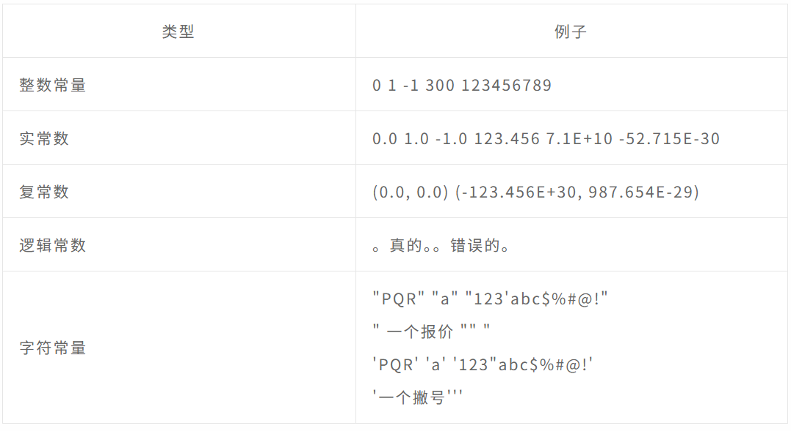
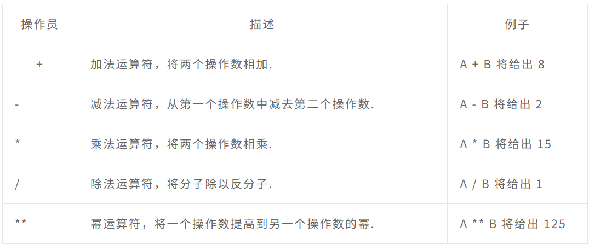
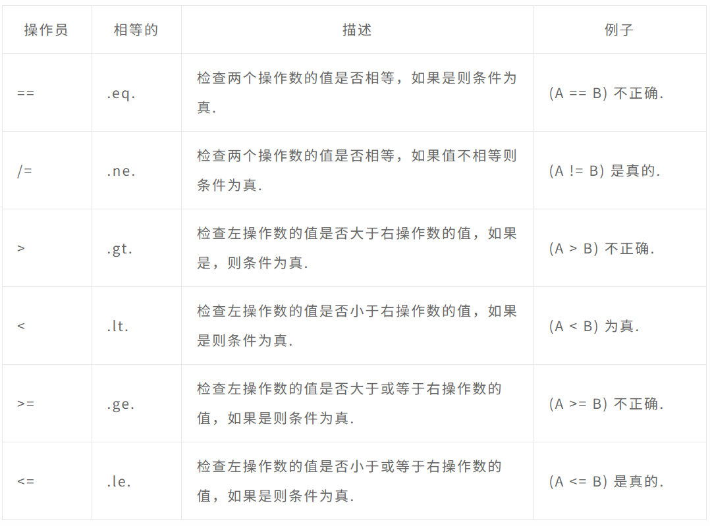
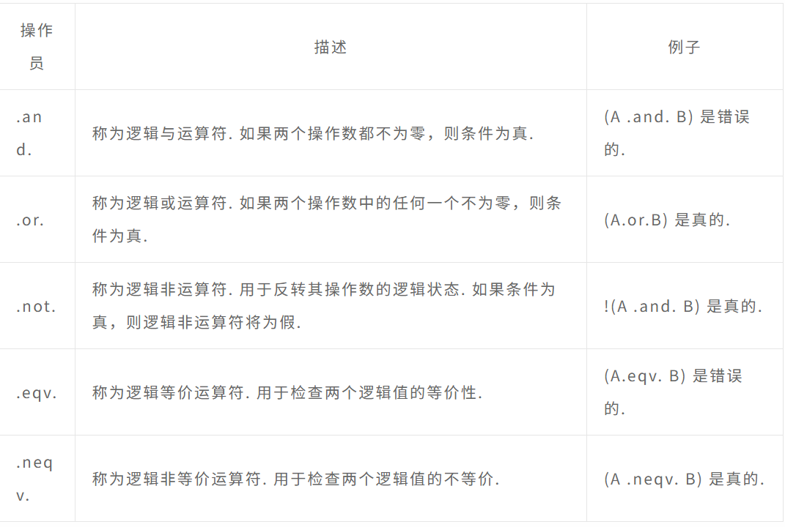
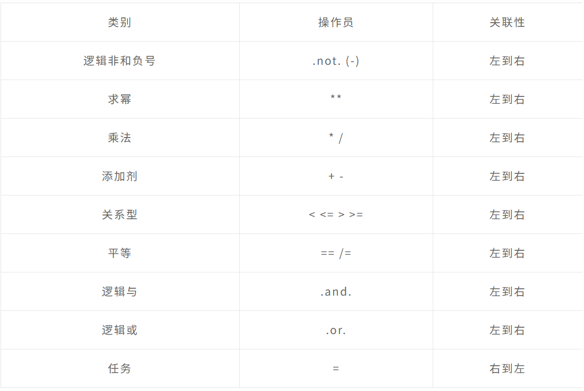
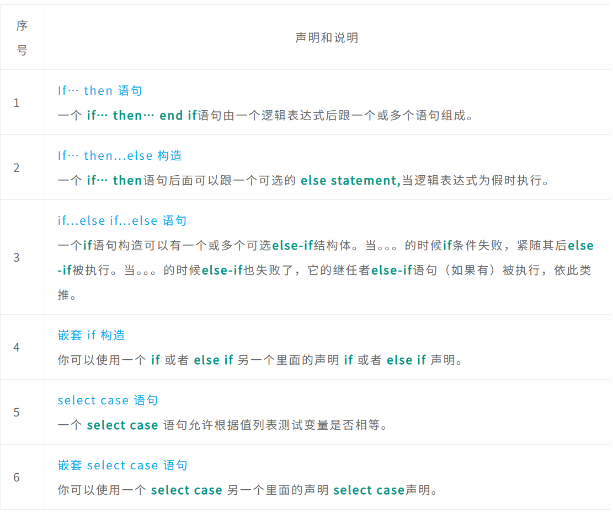
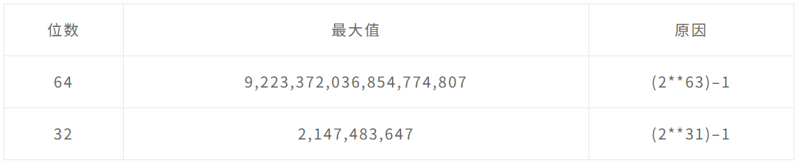

# Fortrann笔记-2

# Fortran变量

## 简述

变量只不过是我们的程序可以操作的存储区域的名称。每个变量都应该有一个特定的类型，它决定了变量内存的大小和布局；可以存储在该内存中的值的范围；以及可以应用于变量的一组操作。
变量的名称可以由字母、数字和下划线字符组成。Fortran 中的名称必须遵循以下规则：

- 它不能超过 31 个字符。
- 它必须由字母数字字符（所有字母和数字 0 到 9）和下划线 (_) 组成。
- 名称的第一个字符必须是字母。
- 名称不区分大小写。

以下为变量类型：


## 变量声明

变量在类型声明语句中的程序（或子程序）开头声明。

变量声明的语法如下：

```fortran
type-specifier :: variable_name
```

例如：

```fortran
integer :: total    
real :: average 
complex :: cx  
logical :: done 
character(len = 80) :: message ! a string of 80 characters
```

之后可以为这些变量赋值，例如：

```fortran
total = 20000  
average = 1666.67   
done = .true.   
message = “A big Hello from CAINIAOYA”
cx = (3.0, 5.0) ! cx = 3.0 + 5.0i
```

还可以使用内在函数**cmplx,**为复杂变量赋值：

```fortran
cx = cmplx (1.0/2.0, -7.0) ! cx = 0.5 – 7.0i 
cx = cmplx (x, y) ! cx = x + yi
```

### **例子**

以下示例演示了变量声明、赋值和在屏幕上的显示：

```fortran
program variableTesting
implicit none
   ! declaring variables
   integer :: total      
   real :: average 
   complex :: cx  
   logical :: done 
   character(len=80) :: message ! a string of 80 characters
   
   !assigning values
   total = 20000  
   average = 1666.67   
   done = .true.   
   message = "A big Hello from CAINIAOYA"
   cx = (3.0, 5.0) ! cx = 3.0 + 5.0i
   Print *, total
   Print *, average
   Print *, cx
   Print *, done
   Print *, message
   
end program variableTesting
```

# Fortran常量

## 简述

常量是指程序在执行过程中不能改变的固定值。这些固定值也称为**literals**.

常量可以是任何基本数据类型，如整数常量、浮点常量、字符常量、复数常量或字符串文字。只有两个逻辑常量：**.true.**和**.false.**

常量与常规变量一样被处理，除了它们的值在定义后不能修改。

## 命名常量和文字

有两种类型的常量：

- 字面常量
- 命名常量

文字常量有一个值，但没有名称。

例如，以下是文字常量：



命名常量具有值和名称。
命名常量应该在程序或过程的开头声明，就像变量类型声明一样，表明它的名称和类型。命名常量使用参数属性声明。例如：

```fortran
real, parameter :: pi = 3.1415927
```

### **例子**

以下程序计算重力作用下的垂直运动引起的位移

```fortran
program gravitationalDisp
! this program calculates vertical motion under gravity 
implicit none  
   ! gravitational acceleration
   real, parameter :: g = 9.81   
   
   ! variable declaration
   real :: s ! displacement   
   real :: t ! time  
   real :: u ! initial speed  
   
   ! assigning values 
   t = 5.0   
   u = 50  
   
   ! displacement   
   s = u * t - g * (t**2) / 2  
   
   ! output 
   print *, "Time = ", t
   print *, 'Displacement = ',s  
   
end program gravitationalDisp
```

# Fortran运算符

## 简述

运算符是一个符号，它告诉编译器执行特定的数学或逻辑操作.Fortran 提供以下类型的运算符：

- 算术运算符
- 关系运算符
- 逻辑运算符

## 算数运算符

下表显示了 Fortran 支持的所有算术运算符. 假设变量**A**持有 5 和变量**B**然后持有 3：



## 关系运算符

下表显示了 Fortran 支持的所有关系运算符. 假设变量**A**持有 10 和变量**B**持有 20：



## 逻辑运算符

Fortran 中的逻辑运算符仅适用于逻辑值 .true.和.false.
下表显示了 Fortran 支持的所有逻辑运算符. 假设变量 A 为 .true. 变量 B 为 .false.：



## **Fortran 中的运算符优先级**

运算符优先级确定表达式中术语的分组. 这会影响表达式的计算方式. 某些运算符的优先级高于其他运算符；例如，乘法运算符的优先级高于加法运算符.
例如，x = 7 + 3 * 2；在这里，x 被赋值为 13，而不是 20，因为运算符 * 的优先级高于 +，所以它首先乘以 3*2，然后加到 7.
具有最高优先级的运算符出现在表格的顶部，那些具有最低优先级的出现在底部. 在表达式中，优先级较高的运算符将首先被计算.



# Fortran决策

## 简述

决策结构要求程序员指定一个或多个要由程序评估或测试的条件，以及要执行的一个或多个语句（如果条件被确定为真），以及可选地，如果条件确定为真，则要执行的其他语句条件被确定为假。

Fortran 提供以下类型的决策结构：



## **if-then 构造**

### 简述

一个**if… then**语句由一个逻辑表达式组成，后跟一个或多个语句并以**end if**陈述。

### 句法

**if… then**的基本语法声明是

```fortran
if (logical expression) then      
   statement  
end if
```

可以为**if**块，然后是命名的语法**if**声明将是

```fortran
[name:] if (logical expression) then      
   ! various statements           
   . . .  
end if [name]
```

如果逻辑表达式的计算结果为**true,**然后是里面的代码块**if…then**语句将被执行。如果逻辑表达式计算为**false,**然后是之后的第一组代码**end if**语句将被执行。

**示例一**

```fortran
program ifProg
implicit none
   ! local variable declaration
   integer :: a = 10
 
   ! check the logical condition using if statement
   if (a < 20 ) then
   
   !if condition is true then print the following 
   print*, "a is less than 20"
   end if
       
   print*, "value of a is ", a
 end program ifProg
```

**示例二**

```fortran
program markGradeA  
implicit none  
   real :: marks
   ! assign marks   
   marks = 90.4
   ! use an if statement to give grade
  
   gr: if (marks > 90.0) then  
   print *, " Grade A"
   end if gr
end program markGradeA   
```

## **If-then-else 构造**

### 简述

一个 **if… then**语句后面可以跟一个可选的 **else statement,**当逻辑表达式为假时执行。

### 句法

**if… then… else**的基本语法声明是

```fortran
if (logical expression) then      
   statement(s)  
else
   other_statement(s)
end if
```

命名语法

```fortran
[name:] if (logical expression) then      
   ! various statements           
   . . . 
   else
   !other statement(s)
   . . . 
end if [name]
```

如果逻辑表达式的计算结果为**true,**然后是里面的代码块**if…then**语句会被执行，否则里面的代码块**else**块将被执行。

**示例**

```fortran
program ifElseProg
implicit none
   ! local variable declaration
   integer :: a = 100
 
   ! check the logical condition using if statement
   if (a < 20 ) then
   
   ! if condition is true then print the following 
   print*, "a is less than 20"
   else
   print*, "a is not less than 20"
   end if
       
   print*, "value of a is ", a
     
end program ifElseProg
```

## **if-else if-else 构造**

### 简述

一个**if**语句构造可以有一个或多个可选**else-if**结构体。当。。。的时候**if**条件失败，紧随其后**else-if**被执行。当。。。的时候**else-if**也失败了，它的继任者**else-if**语句（如果有）被执行，依此类推。

可选的 else 放在最后，当上述条件都不成立时执行。

- 所有 else 语句（else-if 和 else）都是可选的。
- **else-if**可以使用一次或多次。
- **else**必须始终放置在构造的末尾，并且只能出现一次。

### 句法

**if...else if...else**的语法声明是

```fortran
[name:] 
if (logical expression 1) then 
   ! block 1   
else if (logical expression 2) then       
   ! block 2   
else if (logical expression 3) then       
   ! block 3  
else       
   ! block 4   
end if [name]
```

**实例**

```fortran
program ifElseIfElseProg
implicit none
   ! local variable declaration
   integer :: a = 100
 
   ! check the logical condition using if statement
   if( a == 10 ) then
  
      ! if condition is true then print the following 
      print*, "Value of a is 10" 
   
   else if( a == 20 ) then
  
      ! if else if condition is true 
      print*, "Value of a is 20" 
  
   else if( a == 30 ) then
   
      ! if else if condition is true  
      print*, "Value of a is 30" 
  
   else
   
      ! if none of the conditions is true 
      print*, "None of the values is matching" 
      
   end if
   
   print*, "exact value of a is ", a
 
end program ifElseIfElseProg
```

## **嵌套 If 构造**

### 简述

可以使用一个 **if** 或者 **else if** 另一个里面的声明 **if** 或者 **else if** 声明。

### 句法

嵌套的语法**if**声明如下

```fortran
if ( logical_expression 1) then
   !Executes when the boolean expression 1 is true 
   …
   
   if(logical_expression 2)then 
      ! Executes when the boolean expression 2 is true 
      …
   end if
end if
```

**示例**

```fortran
program nestedIfProg
implicit none
   ! local variable declaration
   integer :: a = 100, b= 200
 
   ! check the logical condition using if statement
   if( a == 100 ) then
  
   ! if condition is true then check the following 
      
   if( b == 200 ) then
  
   ! if inner if condition is true 
   print*, "Value of a is 100 and b is 200" 
  
   end if
   end if
   
   print*, "exact value of a is ", a
   print*, "exact value of b is ", b
 
end program nestedIfProg
```

## **select case 构造**

### 简述

一个**select case** 语句允许根据值列表测试变量是否相等。每个值都称为一个案例，并检查每个选择的变量**select case**.

### 句法

**select case**的语法构造如下

```fortran
[name:] select case (expression) 
   case (selector1)          
   ! some statements          
   ... case (selector2)           
   ! other statements           
   ...       
   case default          
   ! more statements          
   ...   
end select [name]
```

以下规则适用于**select**声明

- select 语句中使用的逻辑表达式可以是逻辑、字符或整数（但不是实数）表达式。
- 您可以在一个选择中包含任意数量的 case 语句。每个 case 后跟要比较的值，可以是逻辑、字符或整数（但不是实数）表达式，并确定执行哪些语句。
- case 的常量表达式必须与 select 中的变量具有相同的数据类型，并且必须是常量或文字。
- When the variable being selected on, is equal to a case, the statements following that case will execute until the next case statement is reached.
- 如果 select case (expression) 中的表达式不匹配任何选择器，则执行 case default 块。

**示例一**

```fortran
program selectCaseProg
implicit none
   ! local variable declaration
   character :: grade = 'B'
   select case (grade)
   
      case ('A') 
      print*, "Excellent!" 
      case ('B')
      
      case ('C') 
         print*, "Well done" 
      case ('D')
         print*, "You passed" 
      case ('F')
         print*, "Better try again" 
      case default
         print*, "Invalid grade" 
      
   end select
   
   print*, "Your grade is ", grade 
 
end program selectCaseProg
```

### **指定选择器的范围**

可以通过指定用冒号分隔的下限和上限来指定选择器的范围

```fortran
case (low:high) 
```

**示例二**

```fortran
program selectCaseProg
implicit none
   ! local variable declaration
   integer :: marks = 78
   select case (marks)
   
      case (91:100) 
         print*, "Excellent!" 
      case (81:90)
         print*, "Very good!"
      case (71:80) 
         print*, "Well done!" 
      case (61:70)
         print*, "Not bad!" 
      case (41:60)
         print*, "You passed!"  
      case (:40)
         print*, "Better try again!"  
      case default
         print*, "Invalid marks" 
         
   end select
   print*, "Your marks is ", marks
 
end program selectCaseProg
```

## **嵌套 select case 构造**

### 简述

可以使用一个 **select case** 另一个里面的声明 **select case**声明。

### 句法

```fortran
select case(a) 
   case (100) 
      print*, "This is part of outer switch", a 
   select case(b) 
      case (200)
         print*, "This is part of inner switch", a 
   end select
      
end select
```

**示例**

```fortran
program nestedSelectCase
   ! local variable definition 
   integer :: a = 100
   integer :: b = 200
 
   select case(a) 
      case (100) 
         print*, "This is part of outer switch", a 
         
      select case(b) 
         case (200)
            print*, "This is part of inner switch", a 
      end select
      
   end select
   
   print*, "Exact value of a is : ", a 
   print*, "Exact value of b is : ", b 
 
end program nestedSelectCase
```

## **do 循环构造**

### 简述

do 循环结构允许在给定条件为真时迭代地执行一个语句或一系列语句。

### 句法

```fortran
do var = start, stop [,step]    
   ! statement(s)
   …
end do
```

- 循环变量 var 应该是一个整数
- start 是初始值
- 停止是最终值
- step 是增量，如果省略，则变量 var 增加单位

**例如**

```fortran
! compute factorials
do n = 1, 10
   nfact = nfact * n  
   ! printing the value of n and its factorial
   print*,  n, " ", nfact   
end do
```

### 流程图

do 循环构造的控制流程

- 首先执行初始步骤，并且仅执行一次。此步骤允许您声明和初始化任何循环控制变量。在我们的例子中，变量 var 使用值 start 进行初始化。
- 接下来，评估条件。如果为真，则执行循环体。如果为假，则不执行循环体，控制流跳转到循环之后的下一条语句。在我们的例子中，条件是变量 var 达到其最终值 stop。
- 循环体执行后，控制流跳回到增量语句。此语句允许您更新循环控制变量 var。
- 现在再次评估条件。如果为真，则执行循环并重复该过程（循环体，然后递增步骤，然后再次条件）。条件变为假后，循环终止。

**示例一**

```fortran
program printNum 
implicit none  
   ! define variables
   integer :: n
   
   do n = 11, 20     
      ! printing the value of n 
      print*,  n 
   end do 
   
end program printNum  
```

**示例二**

```fortran
program factorial  
implicit none  
   ! define variables
   integer :: nfact = 1   
   integer :: n  
   
   ! compute factorials   
   do n = 1, 10      
      nfact = nfact * n 
      ! print values
      print*,  n, " ", nfact   
   end do 
   
end program factorial  
```

## **do while循环构造**

### 简述

当给定条件为真时，它重复一个语句或一组语句。它在执行循环体之前测试条件。

### 句法

```fortran
do while (logical expr) 
   statements
end do
```

**例子**

```fortran
program factorial  
implicit none  
   ! define variables
   integer :: nfact = 1   
   integer :: n = 1 
   
   ! compute factorials   
   do while (n <= 10)       
      nfact = nfact * n 
      n = n + 1
      print*,  n, " ", nfact   
   end do 
end program factorial  
```

## **嵌套循环**

### 简述

可以在任何另一个循环构造中使用一个或多个循环构造。您还可以在循环上放置标签。

### 句法

```fortran
iloop: do i = 1, 3
   print*, "i: ", i
   
   jloop: do j = 1, 3         
      print*, "j: ", j         
      
      kloop: do k = 1, 3
         print*, "k: ", k
         
      end do kloop
   end do jloop  
end do iloop
```

**例子**

```fortran
program nestedLoop 
implicit none
   integer:: i, j, k
   
   iloop: do i = 1, 3      
      jloop: do j = 1, 3         
         kloop: do k = 1, 3              
         
            print*, "(i, j, k): ", i, j, k               
            
         end do kloop       
      end do jloop
   end do iloop
end program nestedLoop  
```

## **exit 语句**

### 简述

Exit 语句终止循环或 select case 语句，并将执行转移到紧跟在循环或 select 之后的语句。

**例子**

```fortran
program nestedLoop 
implicit none
integer:: i, j, k
   iloop: do i = 1, 3      
      jloop: do j = 1, 3         
         kloop: do k = 1, 3    
        
         print*, "(i, j, k): ", i, j, k               
         
         if (k==2) then
            exit jloop 
         end if
         
         end do kloop       
      end do jloop  
   end do iloop 
   
end program nestedLoop  
```

## **Cycle 语句**

### 简述

循环语句使循环跳过其主体的其余部分，并在重新迭代之前立即重新测试其条件。

**例子**

```fortran
program cycle_example     
implicit none      
   integer :: i     
   
   do i = 1, 20          
   
      if (i == 5) then 
         cycle          
      end if         
      
   print*, i      
   end do  
   
end program cycle_example
```

## **stop 语句**

### 简述

希望停止执行程序，可以插入stop语句。

**例子**

```fortran
program stop_example     
implicit none
   integer :: i     
   do i = 1, 20          
   
      if (i == 5) then 
         stop          
      end if         
      
      print*, i      
   end do  
   
end program stop_example
```

# **Fortran - 数字**

## 简述

Fortran 中的数字由三种内在数据类型表示

- 整数类型
- 实型
- 复合型

## **整数类型**

整数类型只能保存整数值。以下示例提取了通常的四字节整数中可以保存的最大值

```fortran
program testingInt
implicit none
   integer :: largeval
   print *, huge(largeval)
   
end program testingInt
```

## **真实类型**

它存储浮点数，例如 2.0、3.1415、-100.876 等。

传统上有两种不同的**real**types ：默认的真实类型和**double precision**类型。

## **复杂类型**

用于存储复数。复数有两部分：实部和虚部。两个连续的数字存储单元存储这两个部分。

例如，复数 (3.0, -5.0) 等于 3.0 – 5.0i

通用函数**cmplx()**创建一个复数。无论输入参数的类型如何，它都会产生一个实部和虚部都是单精度的结果。

```fortran
program createComplex
implicit none
   integer :: i = 10
   real :: x = 5.17
   print *, cmplx(i, x)
   
end program createComplex
```

### 例子

```fortran
program ComplexArithmatic
implicit none
   complex, parameter :: i = (0, 1)   ! sqrt(-1)   
   complex :: x, y, z 
   
   x = (7, 8); 
   y = (5, -7)   
   write(*,*) i * x * y
   
   z = x + y
   print *, "z = x + y = ", z
   
   z = x - y
   print *, "z = x - y = ", z 
   
   z = x * y
   print *, "z = x * y = ", z 
   
   z = x / y
   print *, "z = x / y = ", z 
   
end program ComplexArithmatic
```

## **数字的范围、精度和大小**

整数的范围、精度和浮点数的大小取决于分配给特定数据类型的位数。下表显示了整数的位数和范围



下表显示了实数的位数、最小值和最大值以及精度


## **种类说明符**

在科学编程中，经常需要知道工作所在的硬件平台的数据范围和精度。

内在函数**kind()**允许您在运行程序之前查询硬件数据表示的详细信息。

```fortran
program kindCheck
implicit none
   
   integer :: i 
   real :: r 
   complex :: cp 
   print *,' Integer ', kind(i) 
   print *,' Real ', kind(r) 
   print *,' Complex ', kind(cp) 
   
end program kindCheck
```

还可以检查所有数据类型的种类

```fortran
program checkKind
implicit none
   integer :: i 
   real :: r 
   character :: c 
   logical :: lg 
   complex :: cp 
   
   print *,' Integer ', kind(i) 
   print *,' Real ', kind(r) 
   print *,' Complex ', kind(cp)
   print *,' Character ', kind(c) 
   print *,' Logical ', kind(lg)
   
end program checkKind
```

# **Fortran - 字符**

## 简述

Fortran 语言可以将字符视为单个字符或连续字符串。

字符可以是取自基本字符集的任何符号，即取自字母、十进制数字、下划线和 21 个特殊字符。

字符常量是一个固定值的字符串。

内在数据类型**character**存储字符和字符串。字符串的长度可以通过**len**说明符。如果未指定长度，则为 1。您可以通过位置引用字符串中的单个字符；最左边的字符在位置 1。

## **字符声明**

声明字符类型数据与其他变量相同

```fortran
type-specifier :: variable_name
```

**例如**

```fortran
character :: reply, sex
reply = ‘N’ 
sex = ‘F’
```

以下示例演示了字符数据类型的声明和使用

```fortran
program hello
implicit none
   character(len = 15) :: surname, firstname 
   character(len = 6) :: title 
   character(len = 25)::greetings
   
   title = 'Mr. ' 
   firstname = 'Rowan ' 
   surname = 'Atkinson'
   greetings = 'A big hello from Mr. Bean'
   
   print *, 'Here is ', title, firstname, surname
   print *, greetings
   
end program hello
```

## **字符连接**

连接运算符 // 连接字符。以下示例演示了这一点

```fortran
program hello
implicit none
   character(len = 15) :: surname, firstname 
   character(len = 6) :: title 
   character(len = 40):: name
   character(len = 25)::greetings
   
   title = 'Mr. ' 
   firstname = 'Rowan ' 
   surname = 'Atkinson'
   
   name = title//firstname//surname
   greetings = 'A big hello from Mr. Bean'
   
   print *, 'Here is ', name
   print *, greetings
   
end program hello
```

## **一些字符函数**

下表显示了一些常用的字符函数以及描述


**示例 1**

这个例子展示了使用**index**功能

```fortran
program testingChars
implicit none
   character (80) :: text 
   integer :: i 
   
   text = 'The intrinsic data type character stores characters and   strings.'
   i=index(text,'character') 
   
   if (i /= 0) then
      print *, ' The word character found at position ',i 
      print *, ' in text: ', text 
   end if
   
end program testingChars
```

**示例 2**

这个例子演示了使用**trim**功能

```fortran
program hello
implicit none
   character(len = 15) :: surname, firstname 
   character(len = 6) :: title 
   character(len = 25)::greetings
   
   title = 'Mr.' 
   firstname = 'Rowan' 
   surname = 'Atkinson'
   
   print *, 'Here is', title, firstname, surname
   print *, 'Here is', trim(title),' ',trim(firstname),' ', trim(surname)
   
end program hello
```

**示例 3**

这个例子演示了使用**achar**功能

```fortran
program testingChars
implicit none
   character:: ch
   integer:: i
   
   do i = 65, 90
      ch = achar(i)
      print*, i, ' ', ch
   end do
   
end program testingChars
```

## **检查字符的词汇顺序**

以下函数确定字符的词汇序列


```fortran
program testingChars
implicit none
   character:: a, b, c
   a = 'A'
   b = 'a'
   c = 'B'
   
   if(lgt(a,b)) then
      print *, 'A is lexically greater than a'
   else
      print *, 'a is lexically greater than A'
   end if
   
   if(lgt(a,c)) then
      print *, 'A is lexically greater than B'
   else
      print *, 'B is lexically greater than A'
   end if  
   
   if(llt(a,b)) then
      print *, 'A is lexically less than a'
   end if
   
   if(llt(a,c)) then
      print *, 'A is lexically less than B'
   end if
   
end program testingChars
```