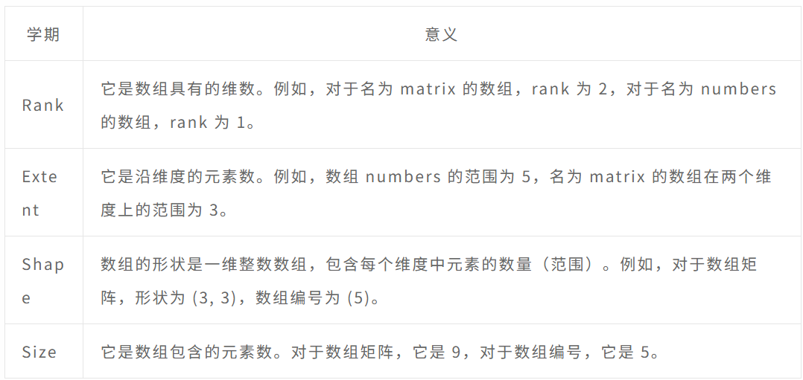
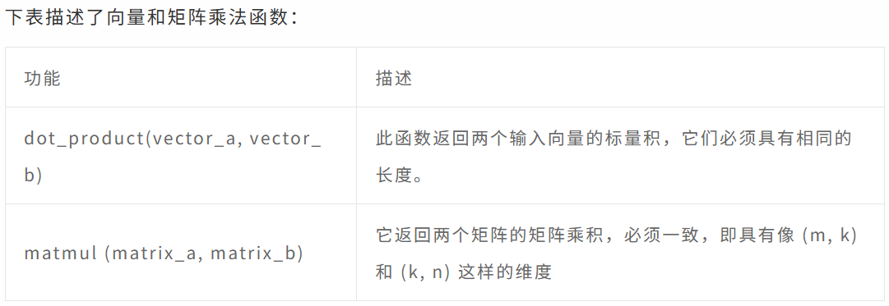
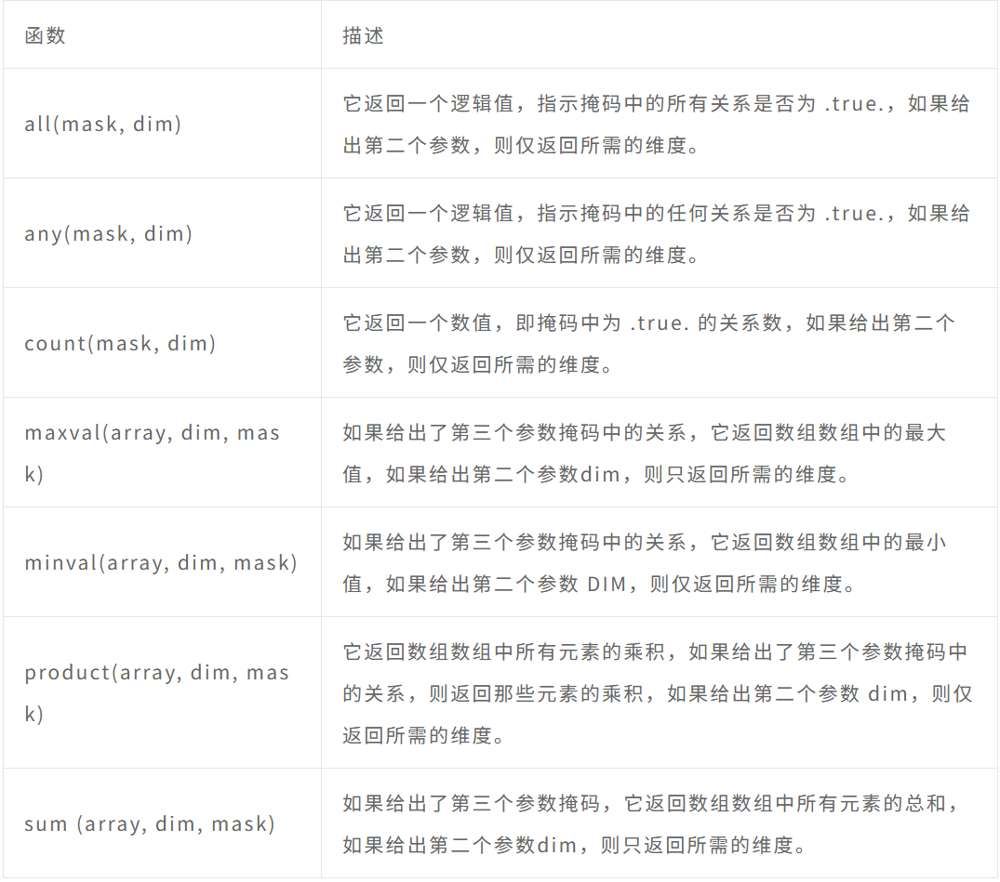

# Fortran笔记-3

# **Fortran - 字符串**

## **简述**

Fortran 语言可以将字符视为单个字符或连续字符串。

一个字符串可能只有一个字符的长度，甚至可以是零长度。在 Fortran 中，字符常量在一对双引号或单引号之间给出。

内在数据类型**character**存储字符和字符串。字符串的长度可以通过**len specifier**. 如果未指定长度，则为 1。您可以通过位置引用字符串中的单个字符；最左边的字符在位置 1。

## **字符串声明**

声明一个字符串与其他变量相同

```fortran
type-specifier :: variable_name
```

### 例如

```fortran
Character(len = 20) :: firstname, surname
```

```fortran
character (len = 40) :: name  
name = “Alex Moo”
```

以下示例演示了字符数据类型的声明和使用

```fortran
program hello
implicit none
   character(len = 15) :: surname, firstname 
   character(len = 6) :: title 
   character(len = 25)::greetings
   
   title = 'Mr.' 
   firstname = 'Rowan' 
   surname = 'Atkinson'
   greetings = 'A big hello from Mr. Beans'
   
   print *, 'Here is', title, firstname, surname
   print *, greetings
   
end program hello
```

## **字符串连接**

连接运算符 // 连接字符串。

```fortran
program hello
implicit none
   character(len = 15) :: surname, firstname 
   character(len = 6) :: title 
   character(len = 40):: name
   character(len = 25)::greetings
   
   title = 'Mr.' 
   firstname = 'Rowan' 
   surname = 'Atkinson'
   
   name = title//firstname//surname
   greetings = 'A big hello from Mr. Beans'
   
   print *, 'Here is', name
   print *, greetings
   
end program hello
```

## **提取子串**

在 Fortran 中，您可以通过对字符串进行索引来从字符串中提取子字符串，并在一对括号中给出子字符串的开始和结束索引。称为范围说明符。

下面的例子展示了如何从字符串 'hello world' 中提取子字符串 'world’

```fortran
program subString
   character(len = 11)::hello
   hello = "Hello World"
   print*, hello(7:11)
   
end program subString 
```

### **例子**

以下示例使用**date_and_time**函数给出日期和时间字符串。我们使用范围说明符来分别提取年、日、月、时、分和秒信息。

```fortran
program  datetime
implicit none
   character(len = 8) :: dateinfo ! ccyymmdd
   character(len = 4) :: year, month*2, day*2
   character(len = 10) :: timeinfo ! hhmmss.sss
   character(len = 2)  :: hour, minute, second*6
   call  date_and_time(dateinfo, timeinfo)
   !  let’s break dateinfo into year, month and day.
   !  dateinfo has a form of ccyymmdd, where cc = century, yy = year
   !  mm = month and dd = day
   year  = dateinfo(1:4)
   month = dateinfo(5:6)
   day   = dateinfo(7:8)
   print*, 'Date String:', dateinfo
   print*, 'Year:', year
   print *,'Month:', month
   print *,'Day:', day
   !  let’s break timeinfo into hour, minute and second.
   !  timeinfo has a form of hhmmss.sss, where h = hour, m = minute
   !  and s = second
   hour   = timeinfo(1:2)
   minute = timeinfo(3:4)
   second = timeinfo(5:10)
   print*, 'Time String:', timeinfo
   print*, 'Hour:', hour
   print*, 'Minute:', minute
   print*, 'Second:', second   
   
end program  datetime
```

## **修剪字符串**

**trim**函数接受一个字符串，并在删除所有尾随空格后返回输入字符串。

### **例子**

```fortran
program trimString
implicit none
   character (len = *), parameter :: fname="Susanne", sname="Rizwan"
   character (len = 20) :: fullname 
   
   fullname = fname//" "//sname !concatenating the strings
   
   print*,fullname,", the beautiful dancer from the east!"
   print*,trim(fullname),", the beautiful dancer from the east!"
   
end program trimString
```

## **字符串左右调整**

功能**adjustl**接受一个字符串并通过删除前导空格并将它们作为尾随空格附加来返回它。

功能**adjustr**接受一个字符串并通过删除尾随空格并将它们附加为前导空格来返回它。

### **例子**

```fortran
program hello
implicit none
   character(len = 15) :: surname, firstname 
   character(len = 6) :: title 
   character(len = 40):: name
   character(len = 25):: greetings
   
   title = 'Mr. ' 
   firstname = 'Rowan' 
   surname = 'Atkinson'
   greetings = 'A big hello from Mr. Beans'
   
   name = adjustl(title)//adjustl(firstname)//adjustl(surname)
   print *, 'Here is', name
   print *, greetings
   
   name = adjustr(title)//adjustr(firstname)//adjustr(surname)
   print *, 'Here is', name
   print *, greetings
   
   name = trim(title)//trim(firstname)//trim(surname)
   print *, 'Here is', name
   print *, greetings
   
end program hello
```

## **在字符串中搜索子字符串**

index 函数接受两个字符串并检查第二个字符串是否是第一个字符串的子字符串。如果第二个参数是第一个参数的子字符串，则返回一个整数，该整数是第一个字符串中第二个字符串的起始索引，否则返回零。

```fortran
program hello
implicit none
   character(len=30) :: myString
   character(len=10) :: testString
   
   myString = 'This is a test'
   testString = 'test'
   
   if(index(myString, testString) == 0)then
      print *, 'test is not found'
   else
      print *, 'test is found at index: ', index(myString, testString)
   end if
   
end program hello
```

# **Fortran - 数组**

## **简述**

数组可以存储相同类型元素的固定大小的顺序集合。数组用于存储数据的集合，但将数组视为相同类型变量的集合通常更有用。
所有数组都由连续的内存位置组成。最低地址对应于第一个元素，最高地址对应于最后一个元素。

数组可以是一维的（如向量）、二维的（如矩阵），Fortran 允许您创建多达 7 维的数组。

## **声明数组**

数组声明为**dimension**属性。

例如，声明一个名为 number 的一维数组，该数组由包含 5 个元素的实数组成

```fortran
real, dimension(5) :: numbers
```

数组的各个元素通过指定它们的下标来引用。数组的第一个元素的下标为 1。数组 numbers 包含五个实变量——numbers(1)、numbers(2)、numbers(3)、numbers(4) 和 numbers(5)。
要创建一个名为矩阵的 5 x 5 二维整数数组，可以编写

```fortran
integer, dimension (5,5) :: matrix  
```

还可以声明一个具有一些明确下限的数组，例如

```fortran
real, dimension(2:6) :: numbers
integer, dimension (-3:2,0:4) :: matrix  
```

## **赋值**

可以为单个成员分配值，例如

```fortran
numbers(1) = 2.0
```

```fortran
do i  =1,5
   numbers(i) = i * 2.0
end do
```

一维数组元素可以使用简写符号直接赋值，称为数组构造函数，例如

```fortran
numbers = (/1.5, 3.2,4.5,0.9,7.2 /)
```

**please note that there are no spaces allowed between the brackets ‘( ‘and the back slash ‘/’**

### **例子**

```fortran
program arrayProg
   real :: numbers(5) !one dimensional integer array
   integer :: matrix(3,3), i , j !two dimensional real array
   
   !assigning some values to the array numbers
   do i=1,5
      numbers(i) = i * 2.0
   end do
   
   !display the values
   do i = 1, 5
      Print *, numbers(i)
   end do
   
   !assigning some values to the array matrix
   do i=1,3
      do j = 1, 3
         matrix(i, j) = i+j
      end do
   end do
   
   !display the values
   do i=1,3
      do j = 1, 3
         Print *, matrix(i,j)
      end do
   end do
   
   !short hand assignment
   numbers = (/1.5, 3.2,4.5,0.9,7.2 /)
   
   !display the values
   do i = 1, 5
      Print *, numbers(i)
   end do
   
end program arrayProg
```

## **数组相关术语**



## **将数组传递给过程**

可以将数组作为参数传递给过程。以下示例演示了该概念

```fortran
program arrayToProcedure      
implicit none      
   integer, dimension (5) :: myArray  
   integer :: i
   
   call fillArray (myArray)      
   call printArray(myArray)
   
end program arrayToProcedure
subroutine fillArray (a)      
implicit none      
   integer, dimension (5), intent (out) :: a
   
   ! local variables     
   integer :: i     
   do i = 1, 5         
      a(i) = i      
   end do  
   
end subroutine fillArray 
subroutine printArray(a)
   integer, dimension (5) :: a  
   integer::i
   
   do i = 1, 5
      Print *, a(i)
   end do
   
end subroutine printArray
```

在上面的例子中，子程序 fillArray 和 printArray 只能用维度为 5 的数组调用。但是，要编写可用于任何大小数组的子程序，可以使用以下技术重写它

```fortran
program arrayToProcedure      
implicit  none    
   integer, dimension (10) :: myArray  
   integer :: i
   
   interface 
      subroutine fillArray (a)
         integer, dimension(:), intent (out) :: a 
         integer :: i         
      end subroutine fillArray      
      subroutine printArray (a)
         integer, dimension(:) :: a 
         integer :: i         
      end subroutine printArray   
   end interface 
   
   call fillArray (myArray)      
   call printArray(myArray)
   
end program arrayToProcedure
subroutine fillArray (a)      
implicit none      
   integer,dimension (:), intent (out) :: a      
   
   ! local variables     
   integer :: i, arraySize  
   arraySize = size(a)
   
   do i = 1, arraySize         
      a(i) = i      
   end do  
   
end subroutine fillArray 
subroutine printArray(a)
implicit none
   integer,dimension (:) :: a  
   integer::i, arraySize
   arraySize = size(a)
   
   do i = 1, arraySize
     Print *, a(i)
   end do
   
end subroutine printArray
```

该程序正在使用**size**函数获取数组的大小。

## **数组部分**

Fortran 提供了一种简单的方法来使用单个语句来引用多个元素或数组的一部分。

要访问数组部分，需要为所有维度提供该部分的下限和上限，以及步幅（增量）。这种符号称为**subscript triplet:**

```fortran
array ([lower]:[upper][:stride], ...)
```

当没有提到上下界时，它默认为您声明的范围，并且步幅值默认为 1。
以下示例演示了该概念

```fortran
program arraySubsection
   real, dimension(10) :: a, b
   integer:: i, asize, bsize
   
   a(1:7) = 5.0 ! a(1) to a(7) assigned 5.0
   a(8:) = 0.0  ! rest are 0.0 
   b(2:10:2) = 3.9
   b(1:9:2) = 2.5
   
   !display
   asize = size(a)
   bsize = size(b)
   
   do i = 1, asize
      Print *, a(i)
   end do
   
   do i = 1, bsize
      Print *, b(i)
   end do
   
end program arraySubsection
```

# **数组内在函数**

Fortran 90/95 提供了几个内置函数。它们可以分为7类。

- [向量和矩阵乘法](https://www.cainiaoya.com/fortran/vector-and-matrix-multiplication.html)
- [Reduction](https://www.cainiaoya.com/fortran/reduction.html)
- [Inquiry](https://www.cainiaoya.com/fortran/inquiry.html)
- [Construction](https://www.cainiaoya.com/fortran/construction.html)
- [Reshape](https://www.cainiaoya.com/fortran/reshape.html)
- [Manipulation](https://www.cainiaoya.com/fortran/manipulation.html)
- [Location](https://www.cainiaoya.com/fortran/location.html)

## **Fortran - 向量和矩阵乘法函数**

### **简述**

下表描述了向量和矩阵乘法函数：



### **Example**

以下示例演示了点积：

```fortran
program arrayDotProduct
   real, dimension(5) :: a, b
   integer:: i, asize, bsize
   
   asize = size(a)
   bsize = size(b)
   
   do i = 1, asize
      a(i) = i
   end do
   
   do i = 1, bsize
      b(i) = i*2
   end do
   
   do i = 1, asize
      Print *, a(i)
   end do
   
   do i = 1, bsize
      Print *, b(i)
   end do
   
   Print*, 'Vector Multiplication: Dot Product:'
   Print*, dot_product(a, b)
   
end program arrayDotProduct
```

以下示例演示了矩阵乘法：

```fortran
program matMulProduct
   integer, dimension(3,3) :: a, b, c
   integer :: i, j
    
   do i = 1, 3
      do j = 1, 3
         a(i, j) = i+j
      end do
   end do
   
   print *, 'Matrix Multiplication: A Matrix'
   
   do i = 1, 3
      do j = 1, 3
         print*, a(i, j)
      end do
   end do
   
   do i = 1, 3
      do j = 1, 3
         b(i, j) = i*j
      end do
   end do
   
   Print*, 'Matrix Multiplication: B Matrix'
   
   do i = 1, 3
      do j = 1, 3
         print*, b(i, j)
      end do
   end do
   
   c = matmul(a, b)
   Print*, 'Matrix Multiplication: Result Matrix'
   
   do i = 1, 3
      do j = 1, 3
         print*, c(i, j)
      end do
   end do
   
end program matMulProduct
```

## **Fortran - 归约函数**

### **简述**

下表描述了归约函数：



### **Example**

```fortran
program arrayReduction
   real, dimension(3,2) :: a 
   a = reshape( (/5,9,6,10,8,12/), (/3,2/) ) 
   
   Print *, all(a>5)
   Print *, any(a>5)
   Print *, count(a>5)
   Print *, all(a>=5 .and. a<10)
  
end program arrayReduction
```

```fortran
program arrayReduction
implicit none
   real, dimension(1:6) :: a = (/ 21.0, 12.0,33.0, 24.0, 15.0, 16.0 /)
   Print *, maxval(a)
   Print *, minval(a)
   Print *, sum(a)
   Print *, product(a)
   
end program arrayReduction 
```