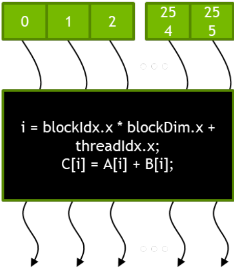

# lecture-11笔记

# CUDA并行编程基础笔记

## 1. 现代GPU架构概述

### 1.1 GPU核心组件

现代GPU（如NVIDIA GeForce RTX 4090）的主要构成：

- **SM（Streaming Multiprocessor，流式多处理器）**：GPU的基本计算单元
    - 128个核心（SP，流处理器）
    - 16MB共享内存
    - 32MB寄存器文件
    - 4个张量核心（专用于机器学习）
- **整体芯片**：128个SM → 共16,384个核心 + 512个张量核心 + 72MB L2缓存


*NVIDIA Fermi架构中的流式多处理器(SM)*

## 2. CUDA执行模型

### 2.1 异构计算

- **主机(Host)**：CPU执行串行代码
- **设备(Device)**：GPU执行并行内核(kernel)代码

```c
c
c
复制
// 典型CUDA程序结构
serial_code(); // CPU执行
kernelA<<<nBlk, nTid>>>(args); // GPU执行
kernelB<<<nBlk, nTid>>>(args); // GPU执行
```

### 2.2 SIMT（单指令多线程）

- 所有线程执行相同指令
- 需要细粒度并行
- 线程组织为**网格(Grid)** → **块(Block)** → **线程(Thread)**

## 3. 向量加法示例

### 3.1 传统C代码

```c
c
c
复制
void vecAdd(float* h_A, float* h_B, float* h_C, int n) {
    for(int i=0; i<n; i++)
        h_C[i] = h_A[i] + h_B[i];
}
```

### 3.2 CUDA实现

### 主机代码

```c
c
c
复制
#include <cuda.h>

void vecAdd(float* h_A, float* h_B, float* h_C, int n) {
    int size = n * sizeof(float);
    float *d_A, *d_B, *d_C;

    // 1. 分配设备内存
    cudaMalloc((void**)&d_A, size);
    cudaMemcpy(d_A, h_A, size, cudaMemcpyHostToDevice);

    // 类似处理d_B和d_C...

    // 2. 启动内核
    dim3 DimGrid((n-1)/256 + 1, 1, 1);  // 网格维度
    dim3 DimBlock(256, 1, 1);           // 块维度
    vecAddKernel<<<DimGrid, DimBlock>>>(d_A, d_B, d_C, n);

    // 3. 拷贝结果回主机并释放内存
    cudaMemcpy(h_C, d_C, size, cudaMemcpyDeviceToHost);
    cudaFree(d_A); cudaFree(d_B); cudaFree(d_C);
}
```

### 设备内核代码

```c
c
c
复制
__global__ void vecAddKernel(float* A, float* B, float* C, int n) {
    int i = threadIdx.x + blockDim.x * blockIdx.x;
    if(i < n) C[i] = A[i] + B[i];
}
```

### 3.3 关键概念

- **数据并行**：将数据分区，每个线程处理一部分
- **线程组织**：
    - `blockIdx.x`：块索引
    - `threadIdx.x`：线程在块中的索引
    - `blockDim.x`：每块的线程数
    
    
    

## 4. 内存模型

### 4.1 内存类型

| 内存类型 | 访问速度 | 作用域 | 生命周期 |
| --- | --- | --- | --- |
| 寄存器 | 最快 | 单个线程 | 线程 |
| 共享内存 | 快 | 块内所有线程 | 块 |
| 全局内存 | 慢 | 所有网格 | 应用 |

### 4.2 内存管理API

```c
c
c
复制
cudaMalloc(&ptr, size);    // 分配设备内存
cudaMemcpy(dest, src, size, dir); // 内存拷贝
cudaFree(ptr);             // 释放内存
```

## 5. 线程调度与执行

### 5.1 线程块分配

- 每个SM可执行多个线程块（最多8个）
- Fermi SM最多支持1,536个线程
- 例如：256线程/块 × 6块 或 512线程/块 × 3块

### 5.2 Warp（线程束）

- **32个线程**组成一个warp
- SM以warp为调度单位
- 同一warp内的线程**SIMD执行**
- 示例：3个块×256线程/块 = 24个warps（每个块8个warps）

## 6. 二维数组处理

### 6.1 图片处理示例

```c
c
c
复制
__global__ void PictureKernel(float* d_Pin, float* d_Pout, int h, int w) {
    int Row = blockIdx.y*blockDim.y + threadIdx.y;
    int Col = blockIdx.x*blockDim.x + threadIdx.x;

    if((Row < h) && (Col < w)) {
        d_Pout[Row*w+Col] = 2.0 * d_Pin[Row*w+Col];
    }
}
```

### 6.2 内存访问模式

- **行优先布局**：C/C++中的标准数组布局
- **内存合并访问**：同一warp访问连续内存地址时效率最高

## 7. 共享内存优化

### 7.1 平铺(Tiling)技术

```c
c
c
复制
__global__ void myKernel(unsigned char* in, unsigned char* out, int w, int h) {
    __shared__ float ds_in[TILE_WIDTH][TILE_WIDTH]; // 声明共享内存

    // 1. 从全局内存加载数据到共享内存
    // 2. 同步等待所有线程完成(__syncthreads())
    // 3. 处理共享内存中的数据
}
```

### 7.2 优势

- 减少全局内存访问
- 利用高速的共享内存
- 需要配合`__syncthreads()`进行线程同步

## 8. 性能优化技巧

### 8.1 内存合并访问

- **理想情况**：同一warp访问连续的32位字（如float）
- **避免**：跨内存段访问（会导致多次DRAM请求）

### 8.2 DRAM突发传输

- 现代DRAM以**突发模式**工作
- 每次访问会传输整个内存段（通常128字节）
- 合并访问能最大化利用带宽

## 9. 总结对比表

| 特性 | CPU | GPU |
| --- | --- | --- |
| 核心数量 | 少（<100） | 多（数千） |
| 线程粒度 | 粗 | 细 |
| 内存延迟 | 低 | 高 |
| 适用场景 | 串行/分支多 | 数据并行 |

> ​提示​：CUDA编程的核心思想是将计算映射到数据，通过大量线程并行处理。理解线程组织、内存层次和同步机制是掌握CUDA的关键。
> 

## 10. 性能优化要点

1. **隐藏延迟**：让足够多的线程保持GPU忙碌
2. **合并访问**：让内存访问模式更高效
3. **共享内存**：减少全局内存访问
4. **避免分支**：尽量让同一warp内的线程执行相同路径

记住：GPU喜欢**大量并行**、**规整访问**的任务！

# 名词理解

### **1. GPU（图形处理器）**

就像一座专门跑高速汽车的赛车场，GPU里有很多“跑车（处理核心）”同时冲刺，专门用来做大量重复的工作，比如绘制图片、处理视频、计算复杂数学题。

### **2. 核心（Processing Element, Core）**

核心就像工厂里的工人，每个工人负责完成一小块任务。GPU有成百上千个工人（核心），让很多任务可以同时进行。

### **3. 内存体系（Memory System）**

像我们的书桌：

- **显存（GDDR）**：大大的书架，存放所有资料（数据），容量大但速度稍慢，随时可以拿出来。
- **缓存（Cache）**：抽屉一样的小存储区，存放经常用的资料，拿起来特别快。

### **4. 核函数（Kernel）**

核函数就像一份工厂的操作手册，告诉每个工人在自己的位置做什么。你写了核函数后，GPU上的工人们就会根据这个指令“协同作业”。

### **5. 线程（Thread）**

线程就像工厂中的工人在流水线上忙碌，每个工人负责一件具体的任务，比如“把这块木板油漆成红色”。GPU里的每个线程就是一个这样的“工人”。

### **6. 线程块（Block）**

线程块像一个小组，里面有很多工人在一起合作，比如一组人在一起拼装家具。每个工人（线程）都知道自己负责的部分，相互合作很方便。

### **7. 网格（Grid）**

网格就像整个工厂的全部工人小组的集合，工人们分布在不同的生产线上（各个块），一起完成大任务。

### **8. warps（“warp”）**

warps可以想象成一组32个工人在同时做一件事，比如同时用36把钳子夹东西。GPU硬件会以warp为调度单位，保证这32个工人同步工作，效率最高。

### **9. 内存类型：**

- **全局内存（Global Memory）**：像整个仓库里存放的货物，任意工人都可以取。但去仓库拿货会很慢，要排长队。
- **共享内存（Shared Memory）**：每个工作组（块）有的小仓库，里面的货物只有组内工人可以用，取货快很多，就像工厂里的专属抽屉。
- **寄存器（Register）**：每个工人自己的小抽屉，里面放着他们随身携带的工具，非常快用。

### **10. Memory Coalescing（记忆合并）**

就像是许多人在超市结账，把所有人排成一列（连续的地址），用一趟快速买完所有东西。如果散乱排队，就得多次结账，特别慢。