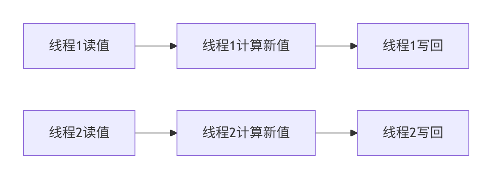

# lecture-12笔记

# 并行编程实践：归约、直方图与原子操作详解

> 基于 HUST-USYD 暑期学校第12讲整理
> 
> 
> **深入解析并行计算核心概念** | 含详细图示与优化代码
> 

---

## 🔍 一、归约操作 (Reduction Operation) 深度解析

### 1.1 归约的本质与应用

- **核心定义**：将**大量数据聚合**为单个值的操作（如：100万个数字求和）
- **数学要求**：
    - **结合律**：`(a ⊕ b) ⊕ c = a ⊕ (b ⊕ c)`
    - **交换律**：`a ⊕ b = b ⊕ a`
- **常见场景**：
    - 科学计算：大规模数据集求和/求积
    - 数据分析：查找最大值/最小值
    - 机器学习：损失函数计算

### 1.2 并行归约的优化策略

### 🚫 初始方案：控制流发散问题

```c
// ❌ 问题代码：步长为1时产生严重控制流发散
for (int stride = 1; stride <= blockDim.x; stride *= 2) {
    __syncthreads();
    if (threadIdx.x % (2*stride) == 0) {
        partialSum[threadIdx.x] += partialSum[threadIdx.x + stride];
    }
}
```

*问题图示：*

线程0: [活跃] 线程1: [空闲] 线程2: [活跃] 线程3: [空闲]
→ 同一warp内线程执行不同路径 → 性能下降

### ✅ 优化方案：连续线程归约

```
// ✅ 优化代码：保持活跃线程连续
for (int stride = blockDim.x/2; stride > 0; stride >>= 1) {
    __syncthreads();
    if (threadIdx.x < stride) {
        partialSum[threadIdx.x] += partialSum[threadIdx.x + stride];
    }
}
```

*优化效果：*

```
步长2: 线程0-1活跃 → 无发散
步长1: 线程0活跃 → 仅最后一步发散
```

### 🧩 共享内存优化技巧

1. **双缓冲加载**：解决非合并访问

```
// 优化全局内存加载
partialSum[threadIdx.x] = input[blockIdx.x*blockDim.x + threadIdx.x];
partialSum[threadIdx.x + blockDim.x] = input[blockIdx.x*blockDim.x + threadIdx.x + blockDim.x];
```

1. **树形归约过程**（以8元素为例）：

```
初始: [3, 1, 7, 0, 4, 1, 6, 3]
步长4: [3+4=7, 1+1=2, 7+6=13, 0+3=3] → [7, 2, 13, 3, -, -, -, -]
步长2: [7+13=20, 2+3=5] → [20, 5, -, -, -, -, -, -]
步长1: [20+5=25] → 最终结果
```

---

## 📊 二、直方图 (Histogram) 并行优化实战

### 2.1 直方图的核心挑战

- **数据竞争**：多线程同时更新同一计数器
- **伪代码示例**：
    
    ```
    bin = calculate_bin(data[i]); // 计算所属区间
    histo[bin]++;                // 多个线程同时写!
    ```
    

### 2.2 原子操作深度剖析

### ⚙️ 原子操作原理

*问题：* 线程1和线程2同时读取旧值 → 计算结果相互覆盖



### 🔒 原子操作解决方案


### ⏱️ 原子操作性能对比

| 内存类型 | 延迟周期 | 适用场景 |
| --- | --- | --- |
| 全局内存(DRAM) | 300-600 | 低竞争场景 |
| L2缓存 | 30-60 | Fermi+架构 |
| 共享内存 | 1-10 | 高竞争场景首选 |

### 2.3 私有化技术完整实现

```
#define BIN_COUNT 7 // 示例：7个字母区间

__global__ void optimized_histo(
    unsigned char *data,
    int data_size,
    unsigned int *global_histo)
{
    // 1. 创建共享内存私有副本
    __shared__ unsigned int private_histo[BIN_COUNT];

    // 2. 初始化私有副本（每个bin归零）
    if (threadIdx.x < BIN_COUNT) {
        private_histo[threadIdx.x] = 0;
    }
    __syncthreads();

    // 3. 交错分区处理数据
    int tid = threadIdx.x + blockIdx.x * blockDim.x;
    int stride = blockDim.x * gridDim.x;

    while (tid < data_size) {
        unsigned char ch = data[tid];
        int bin_index = (ch - 'a') / 4; // 示例：每4字母一个区间

        if (bin_index >= 0 && bin_index < BIN_COUNT) {
            // 使用共享内存原子操作（低延迟）
            atomicAdd(&private_histo[bin_index], 1);
        }
        tid += stride; // 跳到下一个处理位置
    }

    __syncthreads();

    // 4. 合并到全局内存
    if (threadIdx.x < BIN_COUNT) {
        atomicAdd(&global_histo[threadIdx.x], private_histo[threadIdx.x]);
    }
}
```

### 私有化技术优势分析

1. **减少竞争**：每个线程块独立计数
2. **提升吞吐**：共享内存原子操作快10-100倍
3. **全局合并**：最终只需少量全局原子操作

---

## 🧩 三、数据分区策略对比

### 3.1 分段分区 (Sectioned Partitioning)

*问题：* 内存访问不连续 → 无法合并加载 → **带宽利用率<30%**


### 3.2 交错分区 (Interleaved Partitioning)

*优势：* 连续线程访问连续内存 → 合并加载 → **带宽利用率>90%**


---

## ⚙️ 四、高斯消元特别任务解析

### 4.1 特殊矩阵结构

```
c₀₀ c₀₁
c₁₀ c₁₁ c₁₂
c₂₀ c₂₁ c₂₂ c₂₃
c₃₀ c₃₁ c₃₂ c₃₃ c₃₄
...（带状矩阵）
```

### 4.2 并行优化策略

1. **行交换优化**：
    - 只需比较相邻行 → 减少通信量
    
    ```
    // 伪代码：部分主元选择
    int pivot_row = i;
    for (int k = i+1; k < min(i+2, n); k++) { // 仅检查相邻行
        if (fabs(A[k][i]) > fabs(A[pivot_row][i]))
            pivot_row = k;
    }
    ```
    
2. **消元并行化**：
    
    ```
    __global__ void gaussian_elimination(float *A, int n) {
        int col = blockIdx.x * blockDim.x + threadIdx.x;
        if (col > i && col < n) {
            float factor = A[i*n + col] / A[i*n + i];
            for (int k = i; k < min(i+3, n); k++) { // 仅更新非零区域
                A[k*n + col] -= factor * A[k*n + i];
            }
        }
    }
    ```
    
3. **内存访问优化**：
    - 利用共享内存缓存当前行
    - 合并访问矩阵列数据

---

## 🔧 五、开发者工具指南

### 5.1 性能分析工具

| 工具名称 | 命令示例 | 功能描述 |
| --- | --- | --- |
| `nvprof` | `nvprof ./my_program` | 基础性能分析 |
| `nsys` | `nsys profile ./my_program` | 高级时间线分析 |
| `ncu` | `ncu ./my_program` | 指令级性能分析 |

### 5.2 调试工具

```
# 内存错误检测
cuda-memcheck --tool memcheck ./my_program

# 竞争条件检测
cuda-memcheck --tool racecheck ./my_program
```

### 5.3 优化检查清单

- [ ]  全局内存访问是否合并？
- [ ]  共享内存是否充分利用？
- [ ]  原子操作是否在最低层级？
- [ ]  控制流发散是否最小化？
- [ ]  计算与内存操作是否平衡？

---

## 💎 核心结论

1. **归约优化**：树形结构 > 步长方向 > 共享内存利用
2. **直方图优化**：私有化+共享原子 > 全局原子
3. **数据分区**：交错访问 > 分段访问
4. **原子操作**：共享内存 > L2缓存 > 全局内存

> "并行优化的本质是将竞争资源转化为私有资源，
> 
> 
> 通过层次化处理降低同步开销" —— 并行编程黄金法则
> 

### 关键概念速查表

| 术语 | 解释 | 优化建议 |
| --- | --- | --- |
| **控制流发散** | 同一warp内线程执行不同路径 | 保持分支条件与warp对齐 |
| **合并访问** | 连续线程访问连续内存地址 | 使用交错分区策略 |
| **原子操作** | 不可中断的读-改-写操作 | 优先在共享内存使用 |
| **私有化** | 创建线程本地数据副本 | 减少全局内存竞争 |