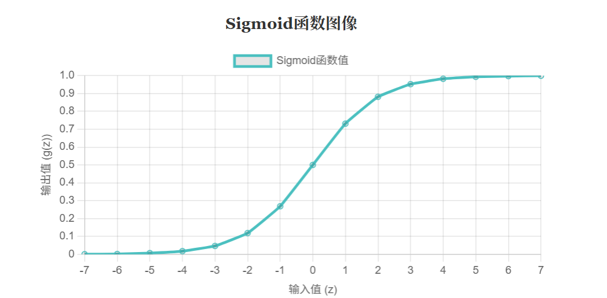

# 吴恩达机器学习（二）

# **逻辑回归及正则化应用笔记**

## 1. 理论概念

### 1.1 逻辑回归简介

逻辑回归（Logistic Regression）是一种用于解决分类问题的机器学习算法，尽管名字中带有“回归”，但它实际上是一种分类模型。它主要用于二分类任务，即预测结果只有两种可能（例如“是/否”、“通过/不通过”等），通常用 $y=1$ 表示我们关注的正类，$y=0$ 表示负类。例如，判断一封邮件是否为垃圾邮件、判断一个肿瘤是良性还是恶性等都属于二分类问题。逻辑回归通过**估计概率**来进行分类：它输出样本属于正类的概率，如果概率大于0.5则判定为正类，否则判定为负类。

为什么不直接使用线性回归来做分类呢？因为线性回归输出的是连续值，可能超出 [0,1] 的范围，而概率必须在0到1之间。此外，线性回归对异常值非常敏感，容易受极端数据影响，导致决策边界偏移。逻辑回归通过引入非线性的**逻辑函数（sigmoid函数）**来解决上述问题，将线性模型的输出压缩到 (0,1) 区间，使其能够表示概率。因此，逻辑回归本质上是在线性回归的基础上套用了一个 sigmoid 函数，将线性预测转换为概率值。

逻辑回归模型可以表示为：**假设函数** $h_θ(x)$ 输出给定特征 $x$ 时 $y=1$ 的概率，即 $h_θ(x) = P(y=1 | x; θ)$。具体地，假设函数通过将线性组合 $θ^T x$ 代入 sigmoid 函数得到：

**Sigmoid函数图像**



其中 $g(z)$ 是 sigmoid 函数，其公式为 $g(z) = 1 / (1 + e^{-z})$。Sigmoid 函数是一个 S 型曲线，无论输入 $z$ 是多大的正数或负数，输出都会被压缩在 0 到 1 之间。当 $z=0$ 时，$g(z)=0.5$；随着 $z$ 增大，输出趋近于 1；随着 z 减小，输出趋近于 0。因此，假设函数 $h_θ(x)$ 给出了样本 $x$ 属于正类的概率估计。例如，对于肿瘤分类问题，如果 $h_θ(x)=0.7$，则意味着根据特征 $x$（如肿瘤大小等），模型预测该患者有70%的概率患恶性肿瘤。

### 1.2 决策边界

逻辑回归的假设函数输出概率值，我们可以据此确定分类的**决策边界**（Decision Boundary）。默认情况下，当 $h_θ(x) ≥ 0.5$ 时，我们预测 $y=1$；当 $h_θ(x) < 0.5$ 时，预测 $y=0$。根据 sigmoid 函数的性质，$h_θ(x) ≥ 0.5$ 等价于 $θ^T x ≥ 0$，因此决策边界由方程 $θ^T x = 0$ 决定。这条边界将特征空间划分为两个区域：一侧的样本被分类为正类，另一侧被分类为负类。

决策边界的形状取决于我们的假设函数。如果使用线性的 $θ^T x$（即不引入多项式特征），那么决策边界是**线性的**（一条直线或平面）；如果引入多项式特征，那么决策边界可以是非线性的曲线。例如，假设我们有两个特征 $x₁, x₂$，并且构造假设函数时包含二次项 $θ₀ + θ₁x₁ + θ₂x₂ + θ₃x₁² + θ₄x₂² = 0$，那么决策边界将是一个圆或椭圆等二次曲线。决策边界是模型本身的属性，由训练得到的参数 $θ$ 决定，与训练集无关（训练集的作用是拟合出合适的 $θ$）。理解决策边界有助于我们直观地认识模型在特征空间中是如何划分不同类别的。

### 1.3 代价函数与优化目标

为了训练逻辑回归模型，我们需要定义一个**代价函数**（Cost Function）来衡量模型预测值与真实值之间的误差，然后通过优化算法最小化这个代价函数以找到最佳参数 $θ$。对于逻辑回归，我们采用**对数损失**（Log Loss）作为代价函数，其形式如下：

对于单个样本 $(x, y)$，代价函数定义为： $J(θ) = \begin{cases} -\log(h_θ(x)) & \text{如果 } y=1, \\ -\log(1 - h_θ(x)) & \text{如果 } y=0. \end{cases}$

上述分段函数可以合并写成：$J(θ) = - [y \log(h_θ(x)) + (1-y) \log(1-h_θ(x))]$。对于 $m$ 个样本的训练集，整体的代价函数是所有样本代价的平均值（或总和，取决于具体实现）：

$J(θ) = -\frac{1}{m} \sum_{i=1}^m \left[ y^{(i)} \log(h_θ(x^{(i)})) + (1-y^{(i)}) \log(1-h_θ(x^{(i)})) \right]$。

这个代价函数实际上对应于**极大似然估计**的思想：我们选择参数 $θ$ 使得训练数据出现的概率最大化。取对数后，最大化似然等价于最小化上述对数损失函数。对数损失函数有一个很好的性质：当真实标签 $y=1$ 时，如果模型预测概率 $h_θ(x)$ 接近1，代价接近0；若预测概率接近0，代价趋向无穷大，这会对错误的预测进行严厉惩罚。同理，当 $y=0$ 时，如果模型预测概率接近0则代价小，接近1则代价极大。因此，该代价函数能够有效地区分正确和错误的预测，并通过优化使模型在训练数据上的预测尽可能接近真实标签。

需要注意的是，我们不能使用线性回归中的均方误差（MSE）作为逻辑回归的代价函数，因为将 sigmoid 函数代入均方误差会导致代价函数变成**非凸函数**，存在许多局部极小值，使得梯度下降等优化算法难以找到全局最小值。而对数损失函数对于逻辑回归来说是凸函数，其图像只有一个全局最小值，没有局部极小值。因此，使用对数损失可以保证我们通过梯度下降等方法找到全局最优的参数。

### 1.4 梯度下降优化

确定了代价函数后，我们的目标是找到参数 $θ$ 使得 $J(θ)$ 最小。最常用的优化算法是**梯度下降**（Gradient Descent）。梯度下降的基本思想是：沿着代价函数的负梯度方向逐步更新参数，直到收敛到最小值点。具体来说，我们首先随机初始化一组参数 $θ$，然后重复执行以下更新步骤：

$θ_j := θ_j - α \frac{\partial}{\partial θ_j} J(θ)$

其中 $α$ 是学习率（learning rate），控制每次迭代步长的大小。关键在于计算代价函数对每个参数 $θ_j$ 的偏导数（梯度）。对于逻辑回归的代价函数，经过求导可以得到梯度的表达式：

$\frac{\partial}{\partial θ_j} J(θ) = \frac{1}{m} \sum_{i=1}^m (h_θ(x^{(i)}) - y^{(i)}) x_j^{(i)}$。

这个结果看起来与线性回归的梯度公式相同，但要注意两种模型的假设函数 $h_θ(x)$ 不同：线性回归中 $h_θ(x)=θ^T x$，而逻辑回归中 $h_θ(x)=g(θ^T x)$，因此两者的梯度公式虽然形式一样，但本质不同。

在每次梯度下降迭代中，我们对所有参数同时进行更新。重复迭代直到代价函数收敛（例如变化很小或达到最大迭代次数），此时得到的 $θ$ 就是使代价函数最小的最优参数。梯度下降算法实现简单，并且对于凸的代价函数能够保证收敛到全局最优解。除了批量梯度下降（每次使用全部训练样本计算梯度）外，还有随机梯度下降、小批量梯度下降等变体，它们在更新速度和收敛稳定性上有所不同，但核心思想一致。

### 1.5 高级优化算法

除了梯度下降，Octave/MATLAB 等工具提供了一些更高效的优化算法，例如**共轭梯度法**（Conjugate Gradient）、**BFGS算法**和**L-BFGS算法**等。这些高级优化算法在不需要手动选择学习率的情况下，可以更快速地收敛到最优解。它们通过利用代价函数的**梯度**（甚至二阶导数信息）来调整搜索方向和步长，因此往往比基础的梯度下降收敛得更快。在吴恩达课程的作业中，就使用了 $Octave$ 的 $fminunc$ 函数（无约束优化求解器）结合 BFGS 算法来训练逻辑回归模型。使用这些算法时，我们需要提供代价函数和梯度的计算，算法内部会自动调整步长并寻找最小值。

高级优化算法的优点是**收敛速度快**，尤其在参数较多时更为明显；缺点是算法内部相对复杂，属于“黑箱”优化过程。不过对于一般的机器学习任务，我们只需调用现有的优化库即可，不需要深入实现这些算法。在实际应用中，如果数据规模不是特别大，使用高级优化算法可以节省训练时间。但在数据规模非常大时，随机梯度下降可能更适用，因为它每次处理一个样本，内存和计算开销更低。

### 1.6 正则化

正则化（Regularization）是防止模型过拟合的重要手段。**过拟合**指的是模型在训练集上表现很好，但在新数据上泛化能力差的现象，通常是由于模型过于复杂，把训练数据中的噪声也学了进去。逻辑回归如果使用过多的高阶多项式特征，可能会拟合出非常复杂的决策边界，从而导致过拟合。为了避免这种情况，我们可以在代价函数中添加**正则化项**，对模型参数的大小进行惩罚，从而降低模型的复杂度。

最常见的正则化方法是**L2正则化**（岭回归），即在代价函数后加上所有参数（通常不包括偏置项 $θ₀$）的平方和乘以一个正则化系数 $λ/(2m)$。正则化后的逻辑回归代价函数为：

$J(θ) = -\frac{1}{m} \sum_{i=1}^m \left[ y^{(i)} \log(h_θ(x^{(i)})) + (1-y^{(i)}) \log(1-h_θ(x^{(i)})) \right] + \frac{\lambda}{2m} \sum_{j=1}^n θ_j^2$。

其中 $λ$ 是正则化强度超参数。$λ$ 越大，对参数的惩罚越重，模型越简单；$λ$ 太小则可能无法有效防止过拟合。正则化项倾向于将参数 $θ_j$ 的值拉向零，使得模型对输入的变化不那么敏感，从而减少过拟合的风险。需要注意，通常不对偏置项 $θ₀$ 正则化，因为 $θ₀$ 只影响决策边界的位置，不影响模型的复杂度。

加入正则化后，梯度下降的更新规则也需要做相应修改：在梯度计算中，对每个 $θ_j (j≥1)$ 额外加上 $(λ/m)θ_j$ 的项。这相当于在每次更新时让参数向零的方向“收缩”一点。通过调整 $λ$ 的大小，我们可以控制模型在训练误差和复杂度之间的权衡。在吴恩达课程的第二个逻辑回归练习中，就要求实现正则化的逻辑回归，并观察不同 λ 值对模型决策边界的影响（$λ=0$ 时容易过拟合，$λ$ 过大则可能欠拟合）。

除了 L2 正则化，还有**L1正则化**（Lasso）等方法，它通过在代价函数中加入参数的绝对值和来惩罚大的参数。L1 正则化会使部分参数变为零，从而起到特征选择的作用（剔除不重要的特征）。在实际应用中，可根据需要选择合适的正则化方式。例如，scikit-learn 库的逻辑回归模型就提供了 $penalty$ 参数来选择 L1 或 L2 正则化，并通过 $C$ 参数（相当于 $1/λ$）控制正则化强度。

## 2. 代码实现

### 2.1 Octave/MATLAB 代码结构

吴恩达机器学习课程的编程练习使用 Octave 或 MATLAB 完成。在逻辑回归部分，主要涉及以下文件和步骤：

- **主程序脚本**：`ex2.m`（用于线性可分数据的逻辑回归）和 `ex2_reg.m`（用于需要正则化的非线性可分数据）。这些脚本会调用学生编写的函数来逐步完成训练过程，并包含一些预设的代码用于加载数据、绘制图像和测试结果等。
- **数据文件**：`ex2data1.txt` 和 `ex2data2.txt`。`ex2data1.txt` 包含两列学生考试成绩和一个录取与否的标签，用于第一个分类问题；`ex2data2.txt` 包含两列微芯片测试结果和一个是否通过质量检测的标签，用于第二个需要正则化的问题。
- **需要实现的函数**：
    - `sigmoid.m`：实现 sigmoid 函数，对输入向量逐元素计算 sigmoid 值。
    - `costFunction.m`：计算逻辑回归的代价函数和梯度。该函数输入参数 $θ$、特征矩阵 $X$ 和标签向量 $y$，输出当前 $θ$ 对应的代价和梯度。
    - `predict.m`：使用训练好的参数 $θ$ 对新样本进行预测，返回预测的类别标签（0或1）。通常根据 $h_θ(x) ≥ 0.5$ 输出1，否则输出0。
    - `costFunctionReg.m`：带正则化的逻辑回归代价函数和梯度计算。在 `costFunction` 的基础上增加了正则化项，用于第二个练习。
- **辅助函数**：`plotData.m`（绘制训练数据的散点图，用不同标记区分正负类）、`plotDecisionBoundary.m`（根据训练好的 $θ$ 绘制决策边界）、`mapFeature.m`（生成多项式特征映射，用于第二个练习将低维特征扩展到高维）等。这些函数由课程提供或需要学生补全部分功能。

整个代码流程大致如下：在 `ex2.m` 中，首先加载并可视化训练数据，然后调用学生实现的 `sigmoid` 函数进行热身练习，接着初始化参数并计算初始代价和梯度以验证实现正确性，之后使用优化算法（如 `fminunc`）来最小化代价函数得到最优 $θ$，然后调用 `plotDecisionBoundary` 绘制出决策边界，最后用 `predict` 函数在训练集上做预测并计算准确率，以评估模型效果。下面将逐步详细分析这些实现步骤。

### 2.2 数据加载与可视化

在 `ex2.m` 脚本的开始部分，程序会加载训练数据集并进行可视化。例如，对于 `ex2data1.txt`，数据包含两列考试成绩和一个录取状态（1表示录取，0表示未录取）。加载数据后，`plotData` 函数被调用来绘制散点图，其中横轴和纵轴分别代表两门考试的成绩，正类（录取）和负类（未录取）样本用不同的符号标出。通过观察散点图，我们可以对数据的分布和可分性有一个直观认识——在第一个练习中，两类样本大致可以用一条直线分开，属于线性可分问题。

可视化数据是一个良好的习惯，它有助于我们选择合适的模型。例如，如果发现正负样本无法用直线分开，那么可能需要引入多项式特征或使用更复杂的模型。在第二个练习中，`ex2data2.txt` 的散点图显示正负类样本分布成一个环形区域，线性决策边界无法很好地分开它们，这暗示我们需要通过特征映射来生成非线性决策边界。

### 2.3 Sigmoid 函数实现

在正式训练模型前，首先需要实现 sigmoid 函数。Sigmoid 函数的 Octave 实现非常简单，只需对输入标量或矩阵逐元素计算 $1 ./ (1 + exp(-z))$ 即可。例如，`sigmoid.m` 函数可能如下：

```
function g = sigmoid(z)
    g = 1.0 ./ (1.0 + exp(-z));
end
```

这个函数应当能够处理向量和矩阵输入，对每个元素应用 sigmoid 变换。在课程练习中，这一步通常作为“热身”练习，用于确保学生正确理解假设函数的形式。我们可以测试一些值来验证 sigmoid 函数是否正确：当输入为0时输出0.5，输入很大的正数时输出接近1，输入很大的负数时输出接近0。确认 sigmoid 函数无误后，就可以继续实现代价函数和梯度。

### 2.4 代价函数与梯度计算

实现逻辑回归的代价函数和梯度是练习的核心部分。在 `costFunction.m` 中，我们需要计算给定 $θ$ 时的代价 $J$ 以及梯度向量 `grad`。根据前面的公式，代价函数可以通过向量化运算高效计算：

- 首先计算假设函数值 `h = sigmoid(X * theta)`，其中 $X$ 是设计矩阵（每一行是一个样本，已添加一列全1作为偏置项），`theta` 是参数向量。
- 然后计算两部分的对数项：`term1 = y .* log(h)`，`term2 = (1 - y) .* log(1 - h)`。
- 代价 $J$ 就是 `mean(term1 + term2)`（即取负的平均值）。
- 梯度 `grad` 可以通过 `(X' * (h - y)) / m` 计算，其中 `$m$` 是样本数。这实际上对每个参数 $θ_j$ 应用了梯度公式 `1/m * sum((h - y) .* X(:,j))`。

需要注意的是，上述计算利用了矩阵运算的向量化技巧，避免了显式的循环，提高了效率和简洁性。在 Octave/MATLAB 中，点乘 `.*` 和求和 `sum` 等操作可以方便地对矩阵逐元素处理。通过向量化实现，我们可以一行代码完成代价和梯度的计算。

实现完 `costFunction` 后，主程序会用初始参数（通常初始化为全零）调用该函数，以验证输出是否符合预期。例如，在第一个练习中，初始 $θ$ 为全零时，计算得到的初始代价约为0.693，梯度约为 [-0.1000, -12.0092, -11.2628]（对应两个特征和一个偏置项）。这些期望值在课程提供的练习说明中给出，用于帮助学生检查代码是否正确。如果计算结果与预期不符，需要调试代价函数和梯度的实现。

### 2.5 使用优化算法训练参数

在验证了代价函数和梯度的正确性后，接下来使用优化算法来寻找最优的参数 $θ$。在 Octave 中，可以使用 `fminunc` 函数来进行无约束优化。我们需要配置优化选项，例如打开梯度目标（告诉 `fminunc` 我们的函数会返回梯度）并设置最大迭代次数。然后，将初始参数、代价函数句柄和选项传递给 `fminunc`，它会返回最优的 $θ$ 以及最小的代价值。

例如，Octave 代码可能如下：

```
options = optimset('GradObj', 'on', 'MaxIter', 400);
[theta, cost] = fminunc(@(t)(costFunction(t, X, y)), initial_theta, options);
```

这里 `@(t)(costFunction(t, X, y))` 创建了一个匿名函数，将参数 $t$ 传递给 `costFunction` 并固定 $X$ 和 $y$，以满足 `fminunc` 的调用要求。运行 `fminunc` 后，`theta` 中将存储优化得到的参数，`cost` 是最终的代价函数值。在第一个练习中，预期得到的代价约为0.203，对应的参数 $θ$ 大约为 [-25.161, 0.206, 0.201]。这些数值可以用于验证优化是否成功。

需要指出的是，使用高级优化算法时不需要手动设置学习率，算法会自适应地调整步长。此外，由于逻辑回归的代价函数是凸的，无论从哪个初始点开始，优化算法都应收敛到全局最优解。在训练完成后，我们可以将得到的 $θ$ 用于后续的预测和分析。

### 2.6 绘制决策边界

得到最优参数 $θ$ 后，我们可以绘制出模型的决策边界，以便直观地观察模型的分类效果。`plotDecisionBoundary.m` 函数通常会执行以下步骤：

- 如果是线性决策边界，只需在特征空间中找到两个点，使得 $θ^T x = 0$，然后连接这两个点形成直线。例如，对于二维特征，可以令 $x₁$ 取两个极端值，计算对应的 $x₂$ 值，从而得到直线上的两个点。
- 如果是非线性决策边界（通过多项式特征得到的），则需要生成一个网格点矩阵，对每个网格点应用特征映射和假设函数，然后绘制等高线，其中 $h_θ(x)=0.5$ 的等高线即为决策边界。

在第一个练习中，决策边界是一条直线，将录取和未录取的样本大致分开。在第二个练习中，由于使用了6次多项式特征，决策边界是一条复杂的曲线，能够更好地拟合数据的非线性分布。通过观察决策边界，我们可以定性地评估模型是否过拟合或欠拟合：如果决策边界非常曲折、紧贴训练样本，可能存在过拟合；如果决策边界过于简单、未能很好区分两类，则可能欠拟合。在第二个练习中，通过调整正则化参数 $λ$，我们可以看到决策边界的变化：$λ=0$ 时边界过于复杂（过拟合），$λ$ 增大时边界变得平滑，$λ$ 过大时边界变得过于简单（欠拟合）。

### 2.7 预测与模型评估

训练完模型后，我们使用 `predict.m` 函数对样本进行分类预测。`predict` 函数的实现逻辑是：对于给定的特征矩阵 $X$，计算 `h = sigmoid(X * theta)`，然后将 $h ≥ 0.5$ 的样本预测为1，其余为0。这实际上就是根据决策边界进行分类的过程。

在练习中，我们通常会用训练集来计算模型的训练准确率，以评估学习效果。例如，在第一个练习中，用训练好的逻辑回归模型预测每个学生是否被录取，然后统计预测正确的比例。预期的训练准确率约为89%。如果模型正确，这个准确率应该与理论值接近。当然，在实际机器学习项目中，我们更关注模型在测试集上的准确率，但在练习中由于数据有限，我们用训练准确率来粗略评估模型性能。

除了准确率，逻辑回归模型还可以直接输出预测的概率值。例如，我们可以用模型来预测一个特定学生的录取概率。在第一个练习中，程序会预测一个两门课分别考了45分和85分的学生的录取概率，预期输出约为0.776（即77.6%的录取概率）。这展示了逻辑回归模型的一个有用特性：它不仅能给出分类结果，还能给出该分类的置信程度（概率）。

### 2.8 正则化逻辑回归实现

第二个编程练习（`ex2_reg.m`）要求我们实现**正则化的逻辑回归**，以处理非线性可分的数据并防止过拟合。其实现步骤与第一个练习类似，但需要注意以下几点：

- **特征映射**：由于 `ex2data2.txt` 中的数据无法用线性决策边界分开，我们首先对特征进行多项式扩展。课程提供的 `mapFeature.m` 函数将两个原始特征 $x₁, x₂$ 映射到最高6次的多项式特征，例如 $x₁, x₂, x₁², x₁x₂, x₂², x₁³, ..., x₁^6, x₂^6$ 等，从而得到一个28维的特征向量。这使得模型能够拟合更复杂的决策边界。
- **正则化代价函数**：在 `costFunctionReg.m` 中实现带正则化的代价和梯度。代价函数在原有对数损失基础上加上 `(lambda/(2*m)) * sum(theta(2:end).^2)`（注意不惩罚 `theta(1)`）。梯度计算则对每个 `theta(j)`（`j≥2`）加上 `(lambda/m)*theta(j)` 项。
- **训练与调参**：使用 `fminunc` 训练正则化逻辑回归时，需要将正则化系数 `lambda` 传递给代价函数（通常通过匿名函数绑定参数）。在练习中，默认的 `lambda` 是1。我们可以尝试不同的 `lambda` 值来观察其对模型的影响：`lambda=0` 时模型不进行正则化，可能过拟合；`lambda` 很大时模型被过度约束，可能欠拟合。通过比较不同 `lambda` 下的决策边界和训练准确率，可以直观地理解正则化的作用。
- **结果分析**：在 `lambda=1` 时，正则化逻辑回归应该能够在训练集上取得较高的准确率（例如约83%）并画出一条较为合理的非线性边界。如果 `lambda=0`，虽然训练准确率可能更高，但决策边界会非常复杂，对噪声敏感；如果 `lambda` 设置得过大（例如100），模型可能无法很好地区分正负类，导致训练准确率显著下降。通过这个练习，我们学习到如何通过调整正则化强度来平衡模型的复杂度和泛化能力。

## 3. 扩展知识

### 3.1 多分类问题与一对多

逻辑回归本身适用于二分类问题。但对于多分类问题（即输出标签 $y$ 有多个可能的类别），我们可以通过**一对多**（One-vs-All，简称 OVA）的策略将其扩展。一对多的基本思想是：针对每个类别 $k$，训练一个二分类的逻辑回归模型，其中将属于类别 $k$ 的样本视为正类，其余所有类别样本视为负类。这样，我们得到 $K$ 个（$K$ 为类别总数）分类器，每个分类器对应一个类别。当需要对新样本进行预测时，我们让每个分类器计算该样本属于其对应类别的概率，然后选择概率最高的那个类别作为预测结果。

例如，假设有一个三分类问题，类别为 $A$、$B$、$C$。我们分别训练三个逻辑回归模型：模型1区分 $A$ vs 非 $A$，模型2区分 $B$ vs 非 $B$，模型3区分 $C$ vs 非 $C$。对于一个未知样本，分别用这三个模型计算概率 $p_A, p_B, p_C$，然后预测该样本属于概率最大的那个类别（比如 $p_A$ 最大则预测为 $A$）。

一对多方法将多分类拆解为多个二分类，实现简单，而且对逻辑回归这样的线性分类器来说效果通常不错。需要注意的是，一对多方法假设各分类器之间相互独立，但实际上它们共享同一组特征，因此可能存在一定的相关性。不过在实践中，一对多已经足够应付许多多分类任务。除了一对多，还有一对一（One-vs-One）等策略，但一对多更为常用，因为其训练的分类器数量等于类别数，而一对一需要 $K*(K-1)/2$ 个分类器，在类别较多时计算量更大。

值得一提的是，对于多分类问题，也可以直接使用**多项式逻辑回归**（Multinomial Logistic Regression），它本质上是逻辑回归在多分类情况下的推广（也称为 softmax 回归）。多项式逻辑回归通过 softmax 函数将线性模型的输出转化为属于各个类别的概率分布，并使用最大似然估计进行训练。它与一对多方法的区别在于：多项式逻辑回归直接对所有类别建模，考虑了类别之间的竞争关系；而一对多方法将每个类别独立建模，可能忽略一些类别间的信息。在类别数不多时，两者效果相近。在吴恩达课程中，主要介绍了一对多方法来处理多分类，这是一种简单而有效的扩展方式。

### 3.2 逻辑回归与线性判别分析（LDA）

线性判别分析（Linear Discriminant Analysis, LDA）是另一种常用的分类方法，它与逻辑回归有相似之处，也有重要区别。两者都可以用于二分类，并且在一定条件下都能得到线性的决策边界。然而，它们的建模思路不同：

- **建模角度**：逻辑回归属于**判别式模型**，它直接对条件概率 $P(y=1 | x)$ 建模，通过 sigmoid 函数将线性函数映射到概率。LDA 则属于**生成式模型**，它假设每个类别的样本服从某种概率分布（通常假设为多元正态分布且各类别共享协方差矩阵），然后通过训练数据估计这些分布的参数，最后利用贝叶斯定理计算后验概率进行分类。
- **假设条件**：LDA 对数据分布有较强的假设（正态分布、同协方差），而逻辑回归对数据分布没有要求，只假设决策边界是线性的。因此，当 LDA 的假设满足时，LDA 往往效率更高，参数估计更准确。而当假设不成立时，逻辑回归由于假设更少，反而可能更稳健。例如，当特征分布明显非正态或各类别协方差差异较大时，LDA 的效果可能下降，而逻辑回归仍能给出合理的分类结果。
- **决策边界**：在二分类情况下，如果 LDA 的假设成立，那么它得到的决策边界也是线性的，与逻辑回归类似。事实上，在满足 LDA 假设的条件下，逻辑回归和 LDA 会得到相似的决策边界。不过，LDA 还可以提供更多信息，例如类别均值和协方差，这在降维（LDA 也可用于特征提取）和异常值检测时有用。而逻辑回归直接输出类别概率，在需要概率估计时更方便。
- **多分类扩展**：LDA 可以很自然地扩展到多分类，通过估计每个类别的均值和共同协方差矩阵，计算每个类别的后验概率。逻辑回归则需要借助一对多等策略来处理多分类。

简而言之，逻辑回归和 LDA 都试图找到线性决策边界，但前者直接拟合后验概率，后者通过拟合数据分布间接得到后验概率。在实际应用中，如果数据大致满足 LDA 的假设，LDA 可能表现更好且所需样本量较少；否则，逻辑回归往往更可靠。另外，逻辑回归比 LDA 更容易扩展到非线性情况（通过引入非线性特征或使用核技巧），而 LDA 主要适用于线性可分的情况。对于初学者来说，理解两者的区别有助于根据数据特点选择合适的模型。

### 3.3 精确率、召回率与阈值调整

在分类任务中，除了整体的准确率，我们还关心**精确率**（Precision）和**召回率**（Recall）这两个指标，它们用于衡量模型在正类预测上的性能。精确率表示“预测为正类的样本中实际为正类的比例”，即 `Precision = TP / (TP + FP)`，其中 `TP` 是真正例数，`FP` 是假正例数。召回率表示“实际为正类的样本中被正确预测的比例”，即 `Recall = TP / (TP + FN)`，其中 `FN` 是假负例数。精确率和召回率反映了模型不同的错误类型：高精确率意味着模型预测正类时很慎重，误报少；高召回率意味着模型尽可能找出了所有正类样本，漏报少。

逻辑回归默认以0.5作为分类阈值，大于0.5判为正类。然而，在实际应用中，我们可以根据具体需求调整这个阈值，从而在精确率和召回率之间取得平衡。例如，在垃圾邮件检测中，我们可能更希望降低假正例（把正常邮件误判为垃圾），因此可以提高阈值，这样精确率提高但召回率可能降低。相反，在疾病筛查中，我们更希望不漏掉真正的患者（降低假负例），因此可以降低阈值，提高召回率但可能引入更多假正例。

精确率和召回率通常是此消彼长的关系，称为**精确率-召回率权衡**（Precision-Recall Trade-off）。通过调整分类阈值，我们可以得到不同的精确率和召回率组合。为了全面评估模型性能，我们可以绘制**P-R曲线**（精确率-召回率曲线），观察在不同阈值下精确率随召回率的变化情况。如果模型的P-R曲线明显高于另一个模型的曲线，则说明前者性能更优。此外，还有一个综合指标 **F1分数**，它是精确率和召回率的调和均值：`F1 = 2*(Precision*Recall)/(Precision+Recall)`。F1分数在两者都较高且均衡时取得较高值，可用于对不同模型或不同阈值下的性能进行比较。

除了P-R曲线，另一个常用的评估工具是**ROC曲线**（受试者工作特征曲线），它绘制的是不同阈值下**真正例率**（True Positive Rate，即召回率）与**假正例率**（False Positive Rate，`FPR = FP/(FP+TN)`）的关系。ROC曲线下的面积（AUC）越大，表示模型性能越好。ROC曲线对正负类样本比例不敏感，在数据不平衡时比准确率更有参考价值。

总之，在分类模型评估中，我们不应只看准确率，还应结合精确率、召回率、F1分数以及ROC-AUC等指标，全面衡量模型在不同需求下的表现。通过调整分类阈值，我们可以根据具体应用场景（例如更看重减少漏诊还是误诊）来优化模型的输出，使其更符合实际需要。

### 3.4 逻辑回归的优缺点

逻辑回归作为经典的分类算法，具有以下优点：

- **简单高效**：逻辑回归模型结构简单，训练速度快，即使在数据量很大时也能高效收敛。它的参数数量等于特征数加一，计算梯度和预测的时间复杂度都很低。
- **可解释性强**：逻辑回归的系数 $θ_j$ 表示对应特征对输出的影响大小和方向。正的系数表示该特征增大时，正类概率增加；负的系数表示该特征增大时，正类概率降低。通过系数我们可以直观地理解哪些特征是重要的，这在需要解释模型决策的领域（如医学、金融）非常有用。
- **输出概率**：逻辑回归直接输出样本属于正类的概率，这不仅可以用于分类，还可以用于排序或风险评估等任务。例如，银行可以根据逻辑回归给出的违约概率来决定贷款额度。
- **适用广泛**：逻辑回归能处理二分类和多分类（通过一对多）问题，对数据的分布假设少，只要求决策边界是线性的。此外，它很容易扩展，通过引入交互项或多项式项可以拟合非线性关系，通过正则化可以防止过拟合。
- **坚实的理论基础**：逻辑回归基于最大似然估计，具有良好的统计性质。它与线性回归类似，结果稳定，不容易受到轻微扰动的影响。

当然，逻辑回归也有一些局限性：

- **线性决策边界**：逻辑回归本质上只能得到线性的决策边界（除非显式引入非线性特征）。如果数据的真实决策边界非常复杂，逻辑回归可能无法很好地拟合，需要借助特征工程或改用非线性模型（如决策树、神经网络等）。
- **对非线性关系和交互作用不敏感**：如果特征之间存在非线性关系或交互效应，逻辑回归无法自动捕捉，需要手动构造这些特征。这一点不如一些自动提取特征的算法（如深度学习）灵活。
- **容易欠拟合**：当特征数量较少或模型过于简单时，逻辑回归可能无法充分拟合数据的复杂模式，导致欠拟合。这时候需要增加特征或使用更复杂的模型。
- **对异常值敏感**：虽然逻辑回归比线性回归对异常值稍稳健一些，但极端的异常值仍会影响模型参数。例如，一个远离群体的正类样本可能将决策边界拉向自己，从而影响整体分类效果。
- **需要注意多重共线性**：如果输入特征之间存在高度相关性（多重共线性），逻辑回归的系数估计会变得不稳定（方差增大）。这时候需要通过特征选择或正则化来缓解。

总的来说，逻辑回归因其简单、高效和可解释，在许多实际问题中仍然是首选的分类模型之一。尤其在数据规模较大但模式相对简单的情况下，逻辑回归往往能以较低的计算成本提供令人满意的结果。对于更复杂的问题，可以将逻辑回归作为基准模型，再与其他更复杂的模型进行比较。理解逻辑回归的优缺点有助于我们在实际项目中做出明智的模型选择和调整。

### 3.5 逻辑回归与深度学习的关系

逻辑回归可以被视为**神经网络**的基础组成单元。事实上，一个没有隐藏层的单层神经网络，使用 sigmoid 激活函数，就是一个逻辑回归模型。因此，逻辑回归可以看作是最简单的**人工神经网络**（只有输入层和输出层，输出层一个神经元，激活函数为 sigmoid）。

从这个角度来说，逻辑回归与深度学习（多层神经网络）有着密切的联系：

- **激活函数**：逻辑回归使用 sigmoid 作为激活函数，将线性组合映射为概率。在早期的神经网络中，隐藏层也常用 sigmoid 或 tanh 等激活函数。现代深度神经网络更多使用 ReLU 等激活函数，但基本思想一致：通过非线性激活引入非线性能力。
- **代价函数**：神经网络常用的交叉熵损失函数，对于二分类问题其实就是逻辑回归的对数损失函数。因此，训练一个二分类的神经网络，其优化目标与逻辑回归是类似的。对于多分类，神经网络使用 softmax 激活加交叉熵损失，这可以看作是逻辑回归在多分类情形下的扩展（softmax回归）。
- **优化算法**：神经网络常用的梯度下降、反向传播等算法，在逻辑回归中也适用。逻辑回归可以看作是反向传播在单层网络上的特例（梯度计算相对简单，无需链式法则递归）。
- **模型复杂度**：逻辑回归是线性模型，而深度学习通过多层网络可以拟合非常复杂的非线性关系。可以把深度学习看作是逻辑回归的推广和扩展：通过堆叠更多的层和非线性激活，深度学习能够学习层次化的特征表示，从而在图像、语音等复杂任务上取得优异性能。
- **应用场景**：逻辑回归由于简单高效，在工业界仍广泛用于许多需要快速部署和解释的任务，例如广告点击率预估、信用评分等。深度学习则在需要高精度和处理非结构化数据（如图像、文本）的场景中表现突出。值得注意的是，即使在深度学习盛行的今天，逻辑回归依然是许多复杂模型（如深度神经网络、集成学习）的基础或对比基准。

吴恩达教授在课程中也提到，理解逻辑回归有助于理解更复杂的神经网络，因为神经网络可以视为多个“逻辑回归单元”的堆叠。例如，一个具有 $n$ 个输入、隐藏层有 $m$ 个神经元、输出层一个神经元的神经网络，可以看作先对输入做 $m$ 次逻辑回归得到隐藏层激活，再对隐藏层激活做一次逻辑回归得到最终输出。因此，掌握逻辑回归的原理和推导，对于学习深度学习大有裨益。

简而言之，逻辑回归是深度学习的“前身”和基础。从逻辑回归出发，我们可以逐步理解神经网络的结构和训练过程。在实践中，我们也可以将简单的逻辑回归模型与复杂的深度模型结合使用：例如，先用逻辑回归快速验证想法，再用深度学习追求更高性能。理解两者的关系有助于我们在机器学习的学习道路上循序渐进，由浅入深。